Usage
=====

0. __init__
###########

    ::
    
        from qtable.qtable import *
        
        qtbl = Qtable(index=['a','c','d','a','e'],columns=['one', 'two', 'three','one','four'])
        qtbl
        
        
        qtbl = Qtable(mat= np.arange(25).reshape((5,5)),index=['a','c','d','a','e'],columns=['one', 'two', 'three','one','four'])
        qtbl

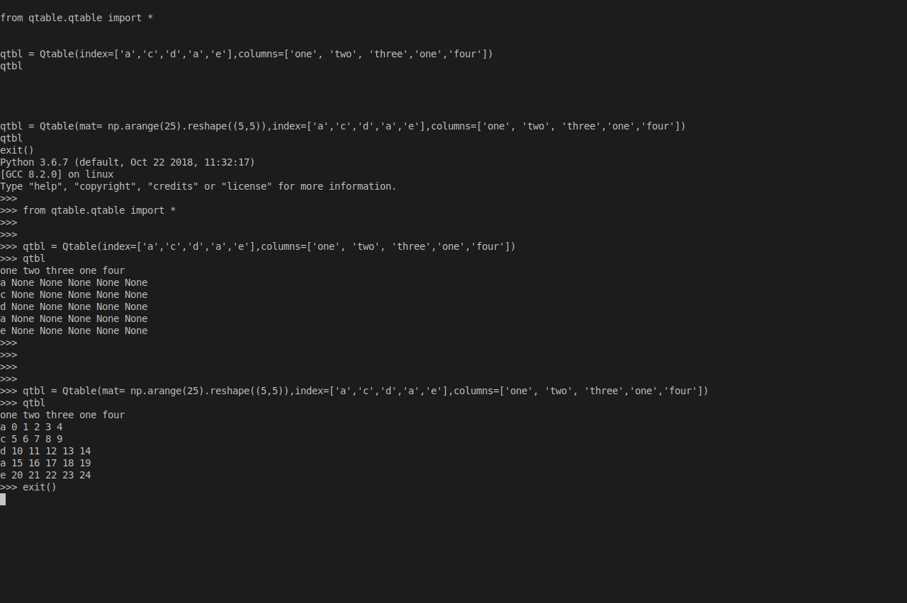

1. __getitem__
##############

    ::
    
        from qtable.qtable import *
        
        qtbl = Qtable(allow_duplicates=False,mat= np.arange(25).reshape((5,5)),index=['a','b','c','d','e'],columns=['one', 'two', 'three','four','five'])
        qtbl
        qtbl['a','one']
        
        
        qtbl = Qtable(mat= np.arange(25).reshape((5,5)),index=['a','c','d','a','e'],columns=['one', 'two', 'three','one','four'])
        qtbl
        qtbl['a','one']
        qtbl['a','one',0,1]
        
        
        

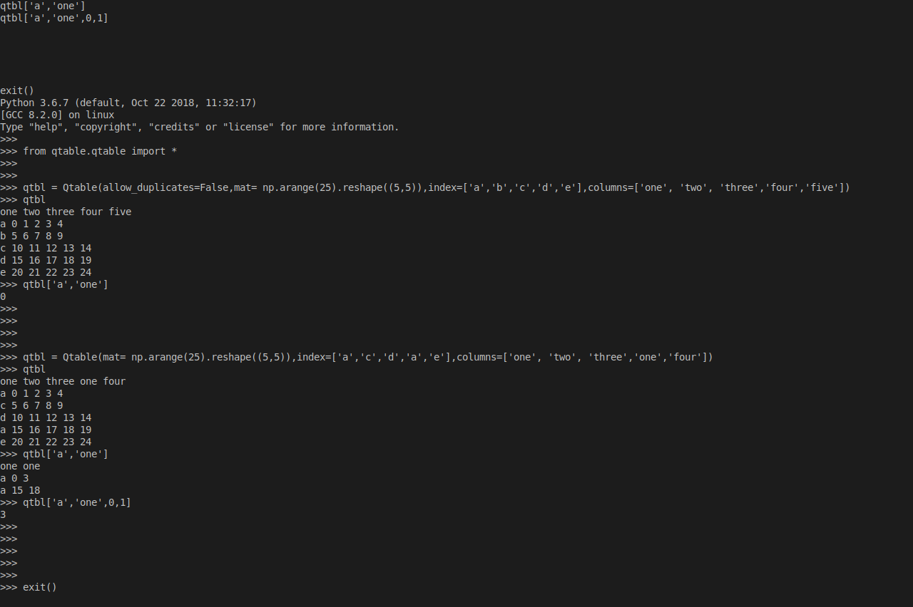

2. __setitem__
##############

    ::
    
        from qtable.qtable import *
        
        qtbl = Qtable(allow_duplicates=False,mat= np.arange(25).reshape((5,5)),index=['a','b','c','d','e'],columns=['one', 'two', 'three','four','five'])
        qtbl
        qtbl['a','one'] = 500
        qtbl
        
        
        qtbl = Qtable(mat= np.arange(25).reshape((5,5)),index=['a','c','d','a','e'],columns=['one', 'two', 'three','one','four'])
        qtbl
        qtbl['a','one']
        qtbl['a','one',0,1] = 300
        qtbl
        qtbl['a','one'] = [[100,300],[1500,1800]]
        qtbl

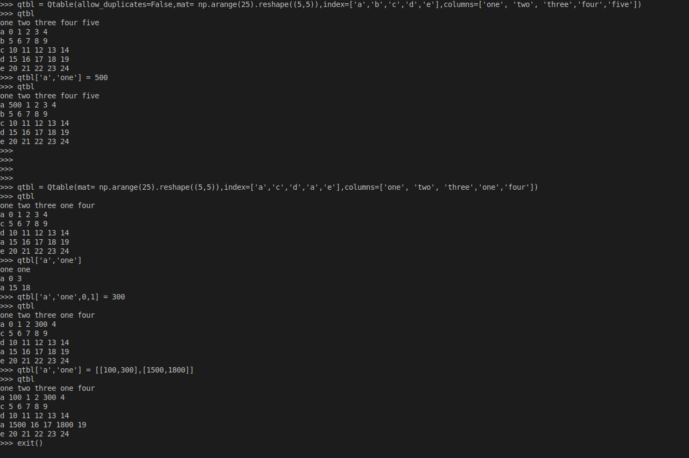

3. row
######

    ::
    
        from qtable.qtable import *
        
        qtbl = Qtable(allow_duplicates=False,mat= np.arange(25).reshape((5,5)),index=['a','b','c','d','e'],columns=['one', 'two', 'three','four','five'])
        qtbl
        qtbl.row('c')
        
        qtbl = Qtable(mat= np.arange(25).reshape((5,5)),index=['a','c','d','a','e'],columns=['one', 'two', 'three','one','four'])
        qtbl
        
        qtbl.row('a')
        qtbl.row('a',0)
        qtbl.row('a',1)
        qtbl.row('a',0,1)

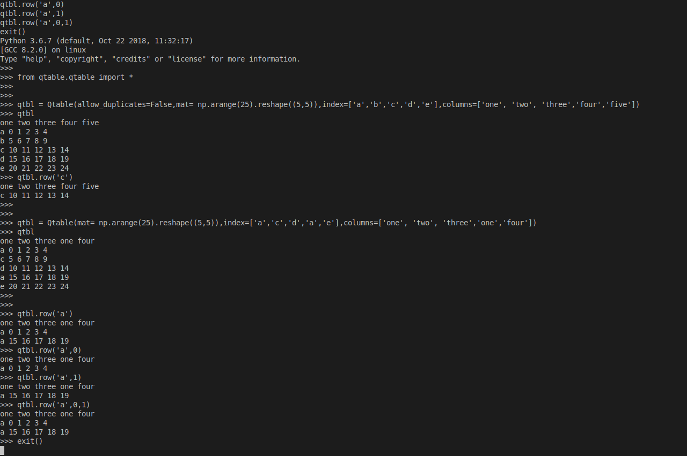

4. col
######

    ::
    
        from qtable.qtable import *
        
        qtbl = Qtable(allow_duplicates=False,mat= np.arange(25).reshape((5,5)),index=['a','b','c','d','e'],columns=['one', 'two', 'three','four','five'])
        qtbl
        qtbl.col('three')
        
        
        qtbl = Qtable(mat= np.arange(25).reshape((5,5)),index=['a','c','d','a','e'],columns=['one', 'two', 'three','one','four'])
        qtbl
        qtbl.col('one')
        qtbl.col('one',0)
        qtbl.col('one',1)

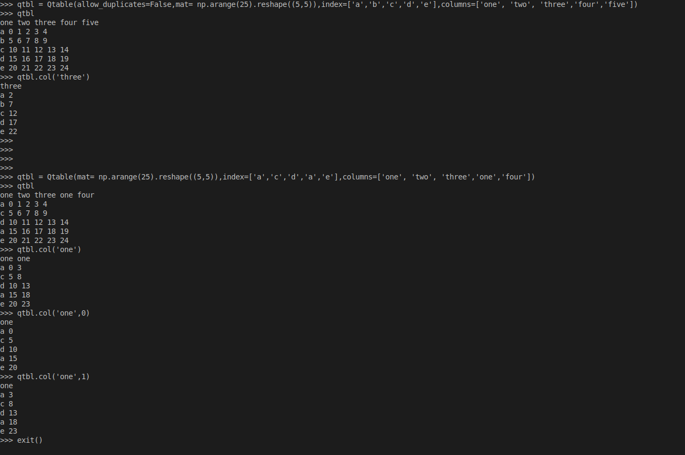

5. cols
#######

    ::
    
        from qtable.qtable import *
        
        qtbl = Qtable(allow_duplicates=False,mat= np.arange(25).reshape((5,5)),index=['a','b','c','d','e'],columns=['one', 'two', 'three','four','five'])
        qtbl
        qtbl.cols('one','three')
        qtbl.cols(['one','three'])
        
        
        qtbl = Qtable(mat= np.arange(25).reshape((5,5)),index=['a','c','d','a','e'],columns=['one', 'two', 'three','one','four'])
        qtbl
        qtbl.cols('one','three')
        qtbl.cols(['one','three'])
        
        
        

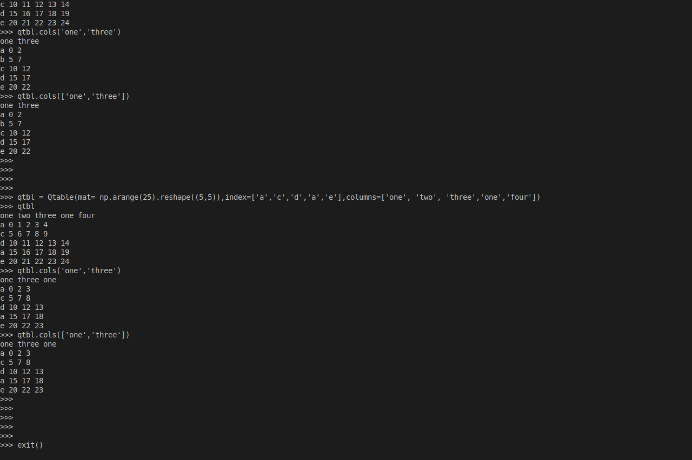

6. rows
#######

    ::
    
        from qtable.qtable import *
        
        qtbl = Qtable(allow_duplicates=False,mat= np.arange(25).reshape((5,5)),index=['a','b','c','d','e'],columns=['one', 'two', 'three','four','five'])
        qtbl
        qtbl.rows('a','c')
        qtbl.rows(['a','c'])
        
        
        qtbl = Qtable(mat= np.arange(25).reshape((5,5)),index=['a','c','d','a','e'],columns=['one', 'two', 'three','one','four'])
        qtbl
        qtbl.rows('a','c')
        qtbl.rows(['a','c'])
        
        
        

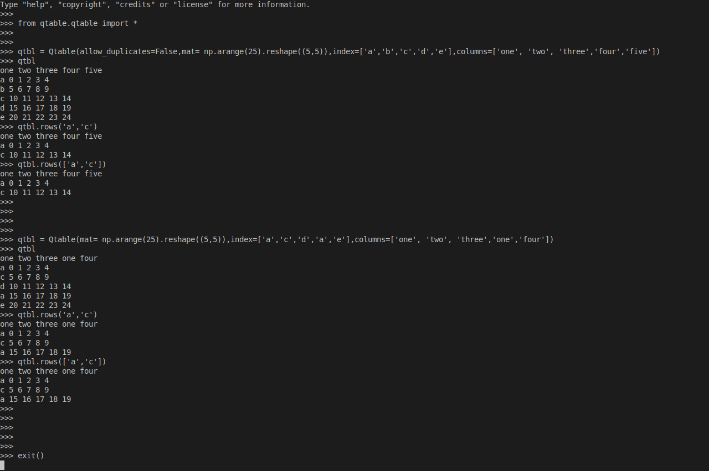

7. subtb
########

    ::
    
        from qtable.qtable import *
        
        
        qtbl = Qtable(allow_duplicates=False,mat= np.arange(25).reshape((5,5)),index=['a','b','c','d','e'],columns=['one', 'two', 'three','four','five'])
        qtbl
        qtbl.subtb(['a','c'],['three','five'])
        
        
        qtbl = Qtable(mat= np.arange(25).reshape((5,5)),index=['a','c','d','a','e'],columns=['one', 'two', 'three','one','four'])
        qtbl
        qtbl.subtb(['a','c'],['one','three'])
        qtbl.subtb(['a','c','d'],['one','three','two','one'])

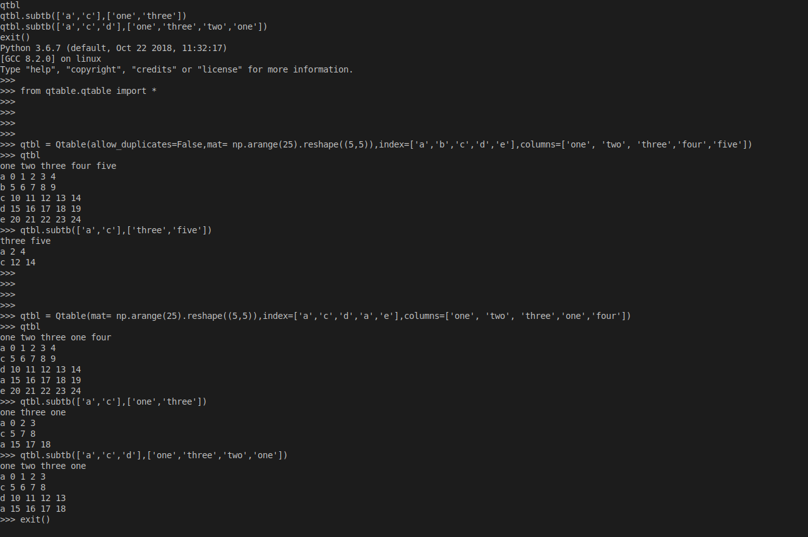

8. crop
#######

    ::
    
        from qtable.qtable import *
        
        qtbl = Qtable(allow_duplicates=False,mat= np.arange(25).reshape((5,5)),index=['a','b','c','d','e'],columns=['one', 'two', 'three','four','five'])
        qtbl
        qtbl.crop('b','two','d','four')
        
        
        qtbl = Qtable(mat= np.arange(25).reshape((5,5)),index=['a','c','d','a','e'],columns=['one', 'two', 'three','one','four'])
        qtbl
        qtbl.crop("a","one","d","one")
        
        
        

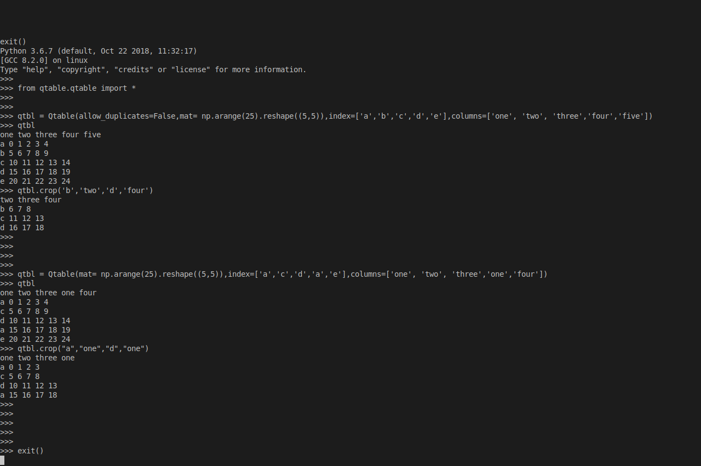

9. swapcol
##########

    ::
    
        from qtable.qtable import *
        
        qtbl = Qtable(allow_duplicates=False,mat= np.arange(25).reshape((5,5)),index=['a','b','c','d','e'],columns=['one', 'two', 'three','four','five'])
        qtbl
        qtbl.swapcol('two','four')
        
        
        qtbl = Qtable(mat= np.arange(25).reshape((5,5)),index=['a','c','d','a','e'],columns=['one', 'two', 'two','one','four'])
        qtbl
        qtbl.swapcol('one','two')
        qtbl.swapcol('one','two',0)
        qtbl.swapcol('one','two',1)
        qtbl.swapcol('one','two',1,1)

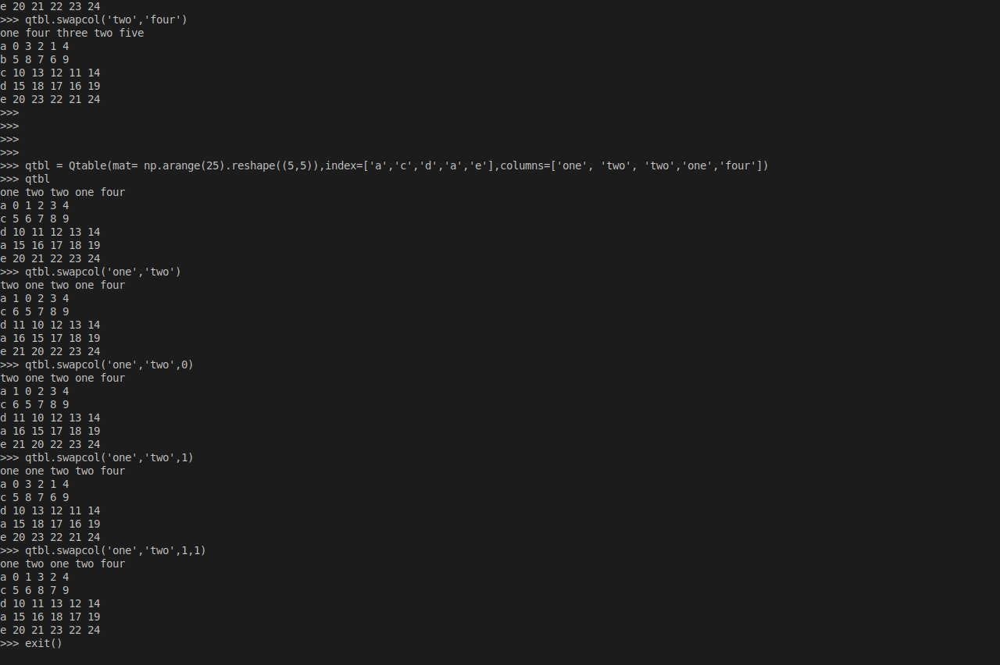

10. reindex_cols
################

    ::
    
        from qtable.qtable import *
        
        qtbl = Qtable(allow_duplicates=False,mat= np.arange(25).reshape((5,5)),index=['a','b','c','d','e'],columns=['one', 'two', 'three','four','five'])
        qtbl
        qtbl.reindex_cols("two","one","three","four","five")
        qtbl.reindex_cols(["two","one","three","four","five"])
        
        
        qtbl = Qtable(mat= np.arange(25).reshape((5,5)),index=['a','c','d','a','e'],columns=['one', 'two', 'two','one','four'])
        qtbl
        qtbl.reindex_cols('one','two','two')
        qtbl.reindex_cols('one','two','two',whiches=[0,0,1])
        qtbl.reindex_cols(['one','two','two'])
        qtbl.reindex_cols(['one','two','two'],whiches=[0,0,1])

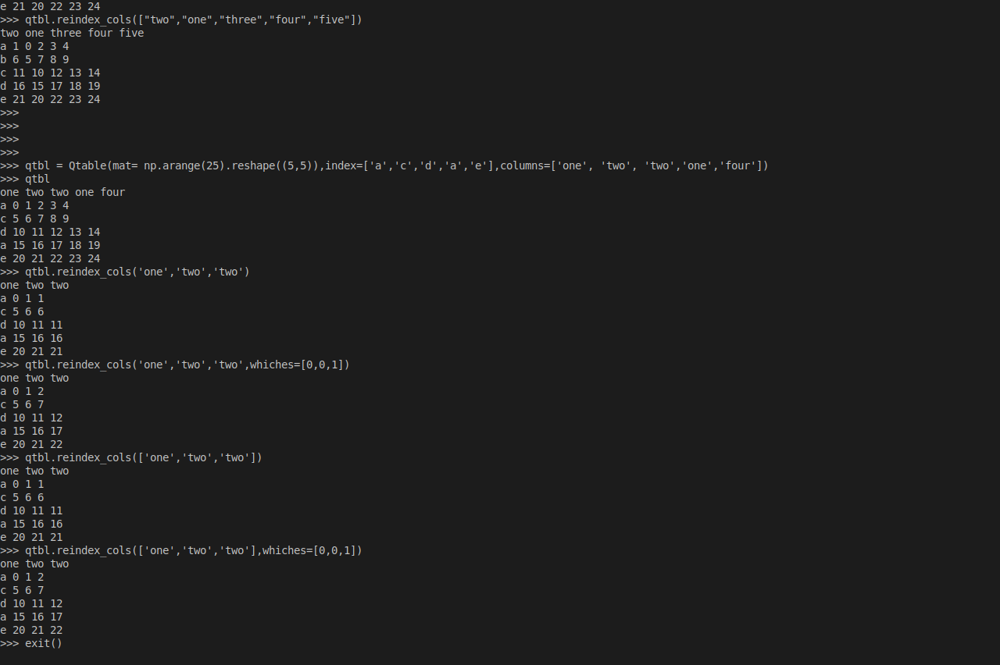

11. swaprow
###########

    ::
    
        from qtable.qtable import *
        
        qtbl = Qtable(allow_duplicates=False,mat= np.arange(25).reshape((5,5)),index=['a','b','c','d','e'],columns=['one', 'two', 'three','four','five'])
        qtbl
        qtbl.swaprow('a','c')
        
        
        qtbl = Qtable(mat= np.arange(25).reshape((5,5)),index=['a','c','c','a','e'],columns=['one', 'two', 'two','one','four'])
        qtbl
        qtbl.swaprow('a','c')
        qtbl.swaprow('a','c',0)
        qtbl.swaprow('a','c',1)
        qtbl.swaprow('a','c',1,0)
        qtbl.swaprow('a','c',1,1)
        
        
        

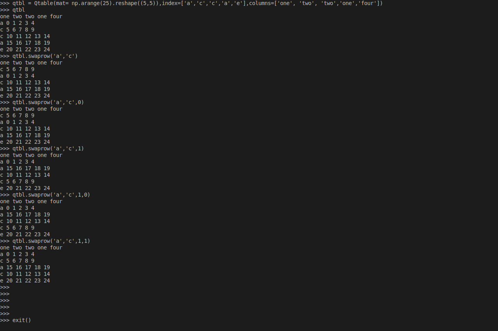

12. reindex_rows
################

    ::
    
        from qtable.qtable import *
        
        qtbl = Qtable(allow_duplicates=False,mat= np.arange(25).reshape((5,5)),index=['a','b','c','d','e'],columns=['one', 'two', 'three','four','five'])
        qtbl
        qtbl.reindex_rows("e","a","d","b","c")
        qtbl.reindex_rows(["e","a","d","b","c"])
        
        
        qtbl = Qtable(mat= np.arange(25).reshape((5,5)),index=['a','c','c','a','e'],columns=['one', 'two', 'two','one','four'])
        qtbl
        qtbl.reindex_rows("a","a","c","c")
        qtbl.reindex_rows(["a","a","c","c"])
        qtbl.reindex_rows("a","a","c","c",whiches=[0,1,0,1])

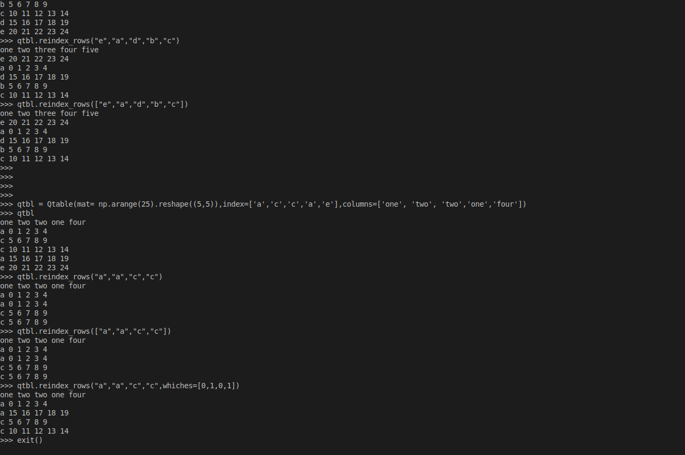

13. rmcol
#########

    ::
    
        from qtable.qtable import *
        
        qtbl = Qtable(allow_duplicates=False,mat= np.arange(25).reshape((5,5)),index=['a','b','c','d','e'],columns=['one', 'two', 'three','four','five'])
        qtbl
        qtbl.rmcol("two")
        
        
        qtbl = Qtable(mat= np.arange(25).reshape((5,5)),index=['a','c','c','a','e'],columns=['one', 'two', 'two','one','four'])
        qtbl
        qtbl.rmcol('one')
        qtbl.rmcol('one',0)
        qtbl.rmcol('one',1)
        
        
        

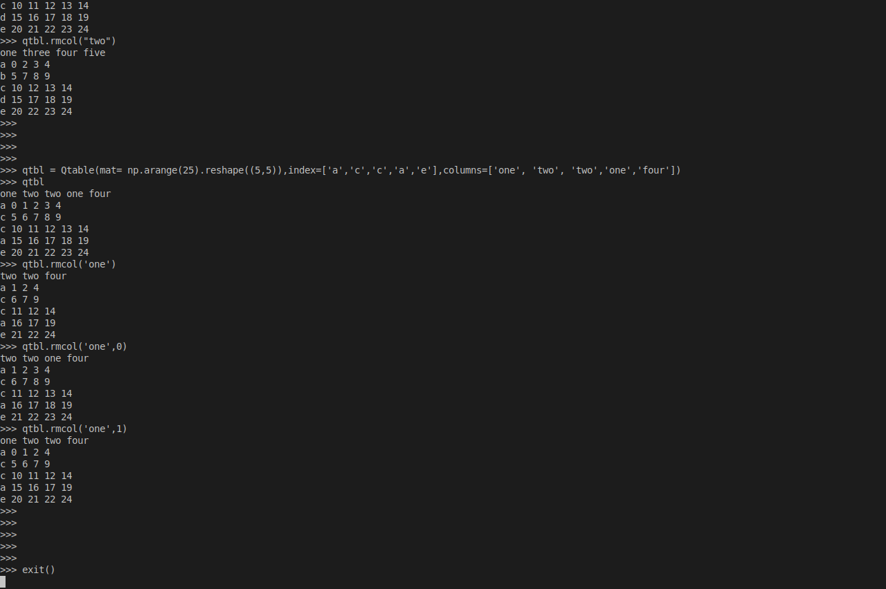

14. rmcols
##########

    ::
    
        from qtable.qtable import *
        
        qtbl = Qtable(allow_duplicates=False,mat= np.arange(25).reshape((5,5)),index=['a','b','c','d','e'],columns=['one', 'two', 'three','four','five'])
        qtbl
        qtbl.rmcols('one','two','four')
        qtbl.rmcols(['one','two','four'])
        
        
        qtbl = Qtable(mat= np.arange(25).reshape((5,5)),index=['a','c','c','a','e'],columns=['one', 'two', 'two','one','four'])
        qtbl
        qtbl.rmcols('one','two')
        qtbl.rmcols('one','two',whiches=[0,0])
        qtbl.rmcols('one','two',whiches=[0,1])
        qtbl.rmcols('one','two',whiches=[1,0])
        qtbl.rmcols('one','two',whiches=[1,1])
        
        
        

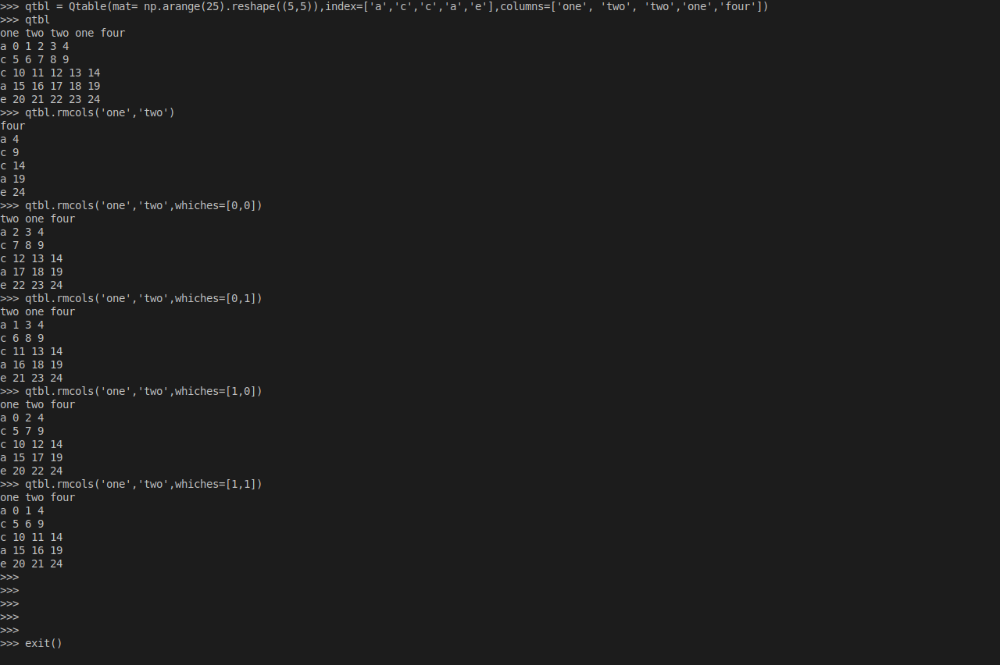

15. rmrow
#########

    ::
    
        from qtable.qtable import *
        
        qtbl = Qtable(allow_duplicates=False,mat= np.arange(25).reshape((5,5)),index=['a','b','c','d','e'],columns=['one', 'two', 'three','four','five'])
        qtbl
        qtbl.rmrow("a")
        
        
        qtbl = Qtable(mat= np.arange(25).reshape((5,5)),index=['a','c','c','a','e'],columns=['one', 'two', 'two','one','four'])
        qtbl
        qtbl.rmrow('a')
        qtbl.rmrow('a',0)
        qtbl.rmrow('a',1)

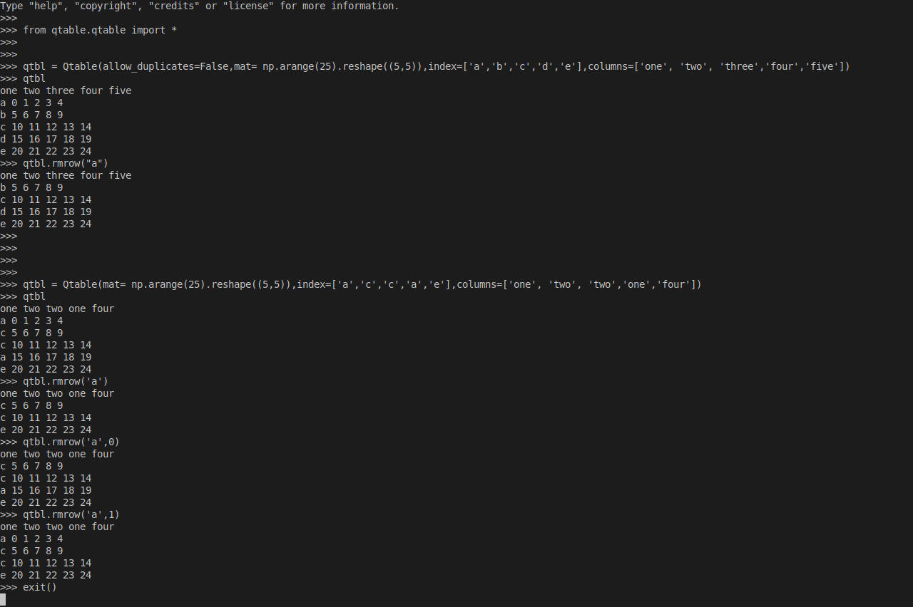

16. rmrows
##########

    ::
    
        from qtable.qtable import *
        
        qtbl = Qtable(allow_duplicates=False,mat= np.arange(25).reshape((5,5)),index=['a','b','c','d','e'],columns=['one', 'two', 'three','four','five'])
        qtbl
        qtbl.rmrows("a","c")
        qtbl.rmrows(["a","c"])
        
        
        qtbl = Qtable(mat= np.arange(25).reshape((5,5)),index=['a','c','c','a','e'],columns=['one', 'two', 'two','one','four'])
        qtbl
        qtbl.rmrows('a','c')
        qtbl.rmrows(['a','c'])
        qtbl.rmrows('a','c',whiches=[0,0])
        qtbl.rmrows('a','c',whiches=[0,1])
        qtbl.rmrows('a','c',whiches=[1,0])
        qtbl.rmrows('a','c',whiches=[1,1])
        
        
        

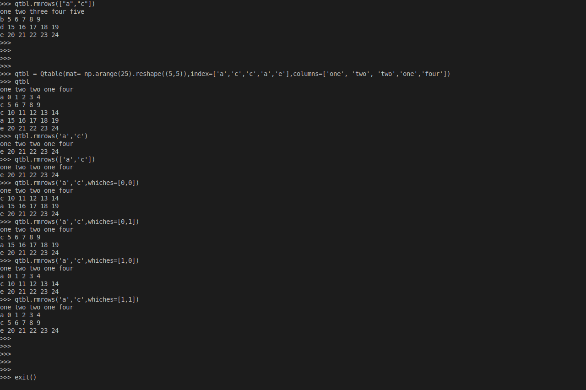

17. insert_col-1
################

    ::
    
        from qtable.qtable import *
        
        qtbl = Qtable(allow_duplicates=False,mat= np.arange(25).reshape((5,5)),index=['a','b','c','d','e'],columns=['one', 'two', 'three','four','five'])
        qtbl
        
        qtbl.insert_col("two","x",100,200,300,400,500)
        qtbl.insert_col("two","x",[100,200,300,400,500])
        qtbl.insert_col("two",{"x":[100,200,300,400,500]})
        
        qtbl.insert_col(2,"x",100,200,300,400,500)
        qtbl.insert_col(2,"x",[100,200,300,400,500])
        qtbl.insert_col(2,{"x":[100,200,300,400,500]})

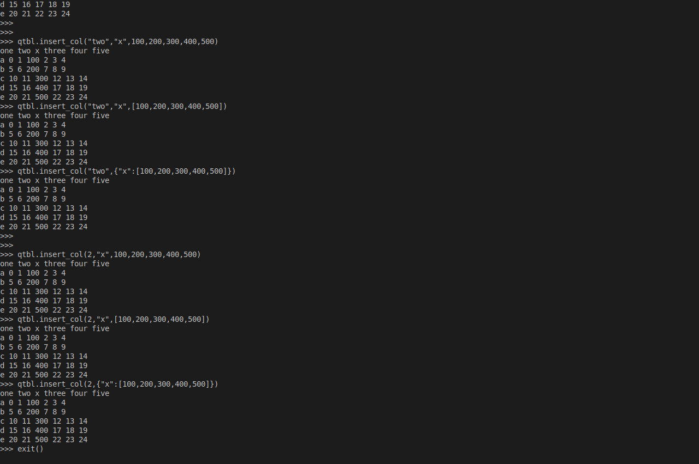

18. insert_col-2
################

    ::
    
        from qtable.qtable import *
        
        qtbl = Qtable(mat= np.arange(25).reshape((5,5)),index=['a','c','c','a','e'],columns=['one', 'two', 'two','one','four'])
        qtbl
        qtbl.insert_col("two","four",100,200,300,400,500)
        qtbl.insert_col("two","four",[100,200,300,400,500])
        qtbl.insert_col("two",{"four":[100,200,300,400,500]})
        qtbl.insert_col(2,"four",100,200,300,400,500)
        qtbl.insert_col(2,"four",[100,200,300,400,500])
        qtbl.insert_col(2,{"four":[100,200,300,400,500]})
        
        qtbl.insert_col("two","four",[100,200,300,400,500],which=0)
        qtbl.insert_col("two","four",[100,200,300,400,500],which=1)

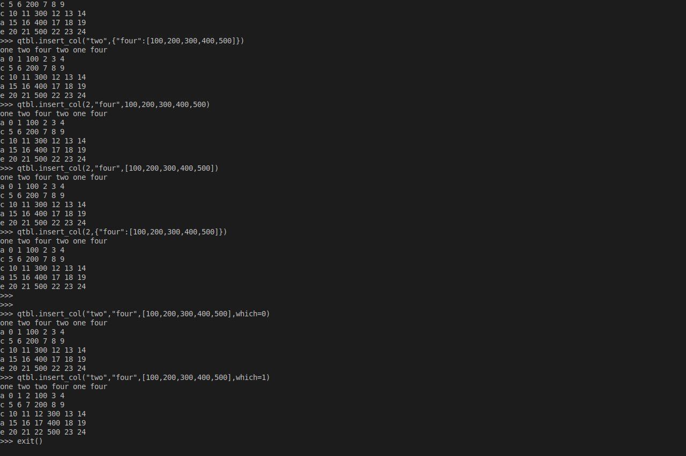

19. insert_cols-1
#################

    ::
    
        from qtable.qtable import *
        
        qtbl = Qtable(allow_duplicates=False,mat= np.arange(25).reshape((5,5)),index=['a','b','c','d','e'],columns=['one', 'two', 'three','four','five'])
        qtbl
        
        qtbl.insert_cols("two","x",100,200,300,400,500,"y",1000,2000,3000,4000,5000)
        qtbl.insert_cols("two","x",[100,200,300,400,500],"y",[1000,2000,3000,4000,5000])
        qtbl.insert_cols("two",{"x":[100,200,300,400,500],"y":[1000,2000,3000,4000,5000]})
        qtbl.insert_cols("two","three",100,200,300,400,500,"three",1000,2000,3000,4000,5000)
        
        qtbl.insert_cols(2,"x",100,200,300,400,500,"y",1000,2000,3000,4000,5000)
        qtbl.insert_cols(2,"x",[100,200,300,400,500],"y",[1000,2000,3000,4000,5000])
        qtbl.insert_cols(2,{"x":[100,200,300,400,500],"y":[1000,2000,3000,4000,5000]})
        qtbl.insert_cols(2,"three",100,200,300,400,500,"three",1000,2000,3000,4000,5000)

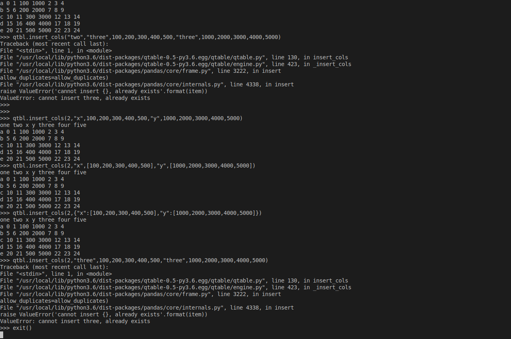

20. insert_cols-2
#################

    ::
    
        from qtable.qtable import *
        
        qtbl = Qtable(mat= np.arange(25).reshape((5,5)),index=['a','c','c','a','e'],columns=['one', 'two', 'two','one','four'])
        qtbl
        qtbl.insert_cols("two",{"x":[100,200,300,400,500],"y":[1000,2000,3000,4000,5000]})
        qtbl.insert_cols("two","three",100,200,300,400,500,"three",1000,2000,3000,4000,5000)
        qtbl.insert_cols("two","three",[100,200,300,400,500],"three",[1000,2000,3000,4000,5000])
        
        qtbl.insert_cols(2,{"x":[100,200,300,400,500],"y":[1000,2000,3000,4000,5000]})
        qtbl.insert_cols(2,"three",100,200,300,400,500,"three",1000,2000,3000,4000,5000)
        qtbl.insert_cols(2,"three",[100,200,300,400,500],"three",[1000,2000,3000,4000,5000])
        
        qtbl.insert_cols("two","x",[100,200,300,400,500],"y",[1000,2000,3000,4000,5000],which=0)
        qtbl.insert_cols("two","x",[100,200,300,400,500],"y",[1000,2000,3000,4000,5000],which=1)
        
        
        

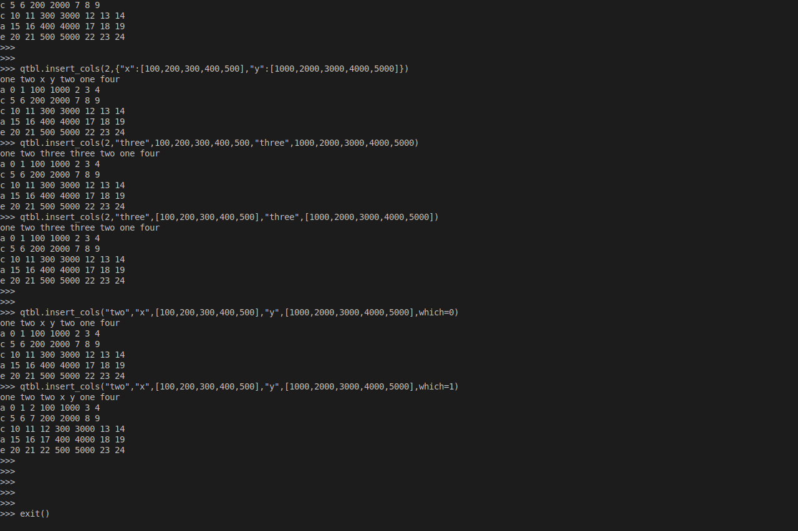

21. insert_row-1
################

    ::
    
        from qtable.qtable import *
        
        qtbl = Qtable(allow_duplicates=False,mat= np.arange(25).reshape((5,5)),index=['a','b','c','d','e'],columns=['one', 'two', 'three','four','five'])
        qtbl
        qtbl.insert_row("b","x",100,200,300,400,500)
        qtbl.insert_row("b","x",[100,200,300,400,500])
        qtbl.insert_row("b",{"x":[100,200,300,400,500]})
        qtbl.insert_row(2,"x",100,200,300,400,500)
        qtbl.insert_row(2,"x",[100,200,300,400,500])
        qtbl.insert_row(2,{"x":[100,200,300,400,500]})

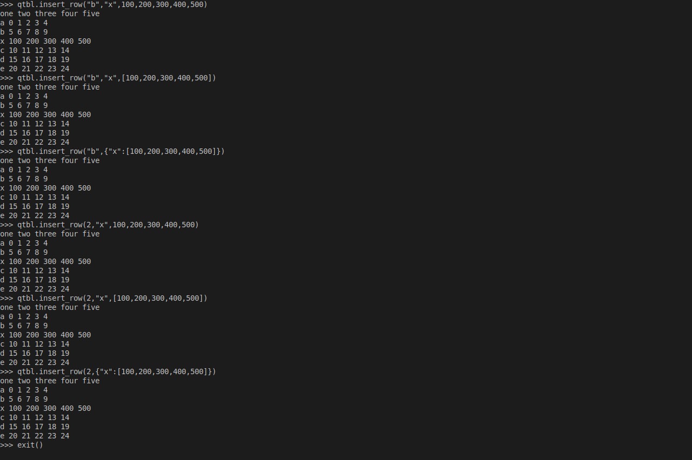

22. insert_row-2
################

    ::
    
        from qtable.qtable import *
        
        qtbl = Qtable(mat= np.arange(25).reshape((5,5)),index=['a','c','c','a','e'],columns=['one', 'two', 'two','one','four'])
        qtbl
        qtbl.insert_row("a","c",100,200,300,400,500)
        qtbl.insert_row("a","c",[100,200,300,400,500])
        qtbl.insert_row("a",{"c":[100,200,300,400,500]})
        qtbl.insert_row(0,"c",100,200,300,400,500)
        qtbl.insert_row(0,"c",[100,200,300,400,500])
        qtbl.insert_row(0,{"c":[100,200,300,400,500]})
        
        qtbl.insert_row("a","c",[100,200,300,400,500],which=0)
        qtbl.insert_row("a","c",[100,200,300,400,500],which=1)

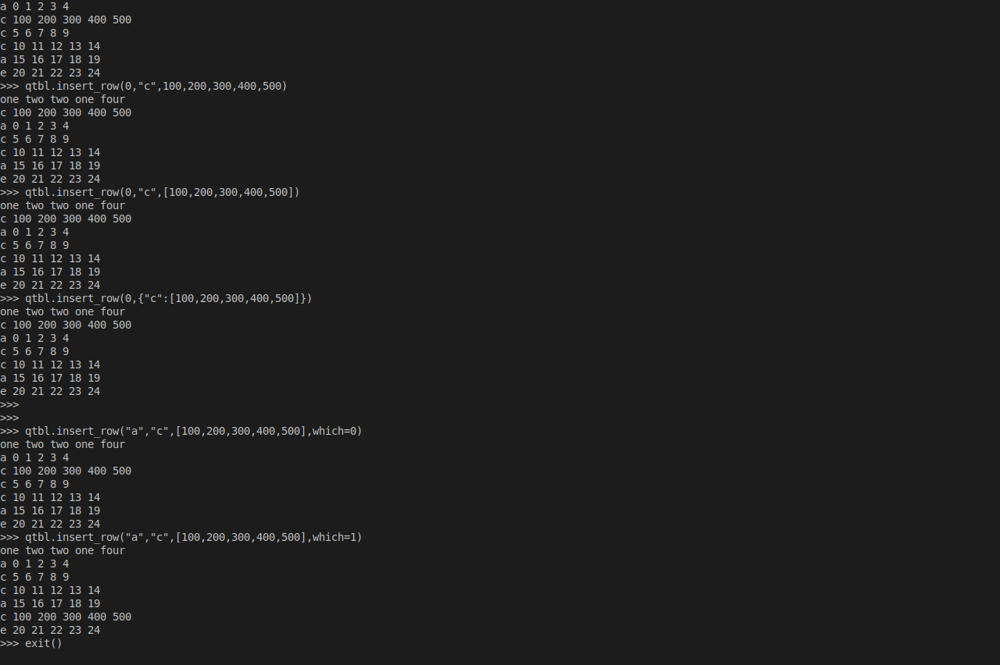

23. insert_rows-1
#################

    ::
    
        from qtable.qtable import *
        
        qtbl = Qtable(allow_duplicates=False,mat= np.arange(25).reshape((5,5)),index=['a','b','c','d','e'],columns=['one', 'two', 'three','four','five'])
        qtbl
        qtbl.insert_rows("b","x",100,200,300,400,500,"y",1000,2000,3000,4000,5000)
        qtbl.insert_rows("b","x",[100,200,300,400,500],"y",[1000,2000,3000,4000,5000])
        qtbl.insert_rows("b",{"x":[100,200,300,400,500],"y":[1000,2000,3000,4000,5000]})
        qtbl.insert_rows(2,"x",100,200,300,400,500,"y",1000,2000,3000,4000,5000)
        qtbl.insert_rows(2,"x",[100,200,300,400,500],"y",[1000,2000,3000,4000,5000])
        qtbl.insert_rows(2,{"x":[100,200,300,400,500],"y":[1000,2000,3000,4000,5000]})

.. image:: ./images/insert_rows-1.svg

24. insert_rows-2
#################

    ::
    
        from qtable.qtable import *
        
        qtbl = Qtable(mat= np.arange(25).reshape((5,5)),index=['a','c','c','a','e'],columns=['one', 'two', 'two','one','four'])
        qtbl
        
        qtbl.insert_rows("a","x",100,200,300,400,500,"y",1000,2000,3000,4000,5000)
        qtbl.insert_rows("a","x",[100,200,300,400,500],"y",[1000,2000,3000,4000,5000])
        qtbl.insert_rows("a",{"x":[100,200,300,400,500],"y":[1000,2000,3000,4000,5000]})
        qtbl.insert_rows(0,"x",100,200,300,400,500,"y",1000,2000,3000,4000,5000)
        qtbl.insert_rows(0,"x",[100,200,300,400,500],"y",[1000,2000,3000,4000,5000])
        qtbl.insert_rows(0,{"x":[100,200,300,400,500],"y":[1000,2000,3000,4000,5000]})
        
        qtbl.insert_rows("a","x",[100,200,300,400,500],"y",[1000,2000,3000,4000,5000],which=0)
        qtbl.insert_rows("a","x",[100,200,300,400,500],"y",[1000,2000,3000,4000,5000],which=1)

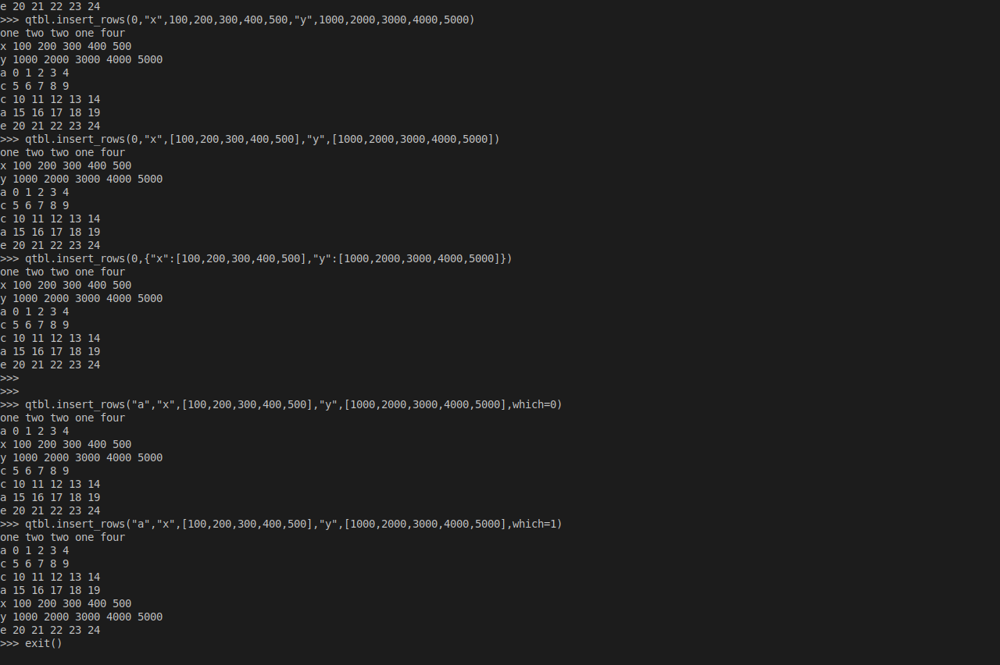

25. append_col-1
################

    ::
    
        from qtable.qtable import *
        
        qtbl = Qtable(allow_duplicates=False,mat= np.arange(25).reshape((5,5)),index=['a','b','c','d','e'],columns=['one', 'two', 'three','four','five'])
        qtbl
        
        qtbl.append_col("x",100,200,300,400,500)
        qtbl.append_col("x",[100,200,300,400,500])
        qtbl.append_col({"x":[100,200,300,400,500]})
        
        qtbl.append_col("x",100,200,300,400,500)
        qtbl.append_col("x",[100,200,300,400,500])
        qtbl.append_col({"x":[100,200,300,400,500]})

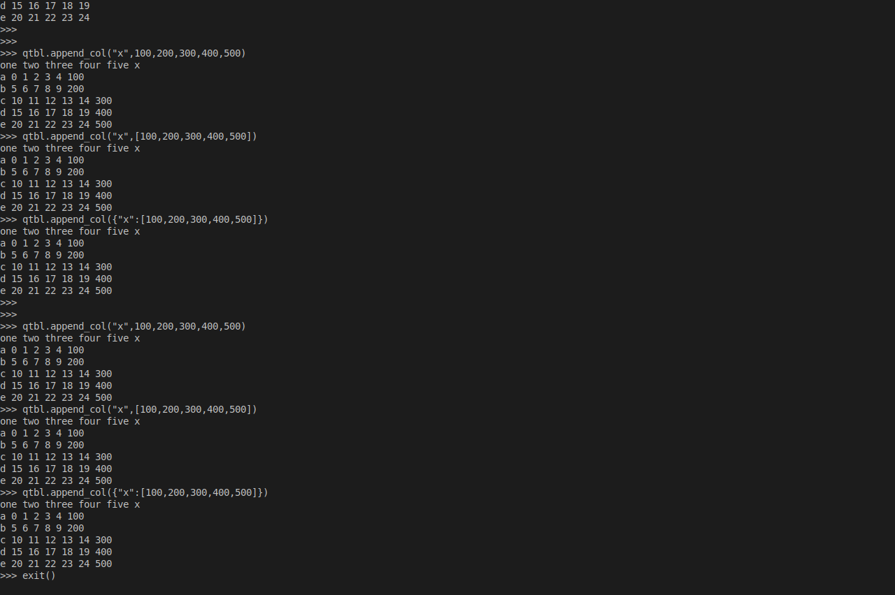

26. append_col-2
################

    ::
    
        from qtable.qtable import *
        
        qtbl = Qtable(mat= np.arange(25).reshape((5,5)),index=['a','c','c','a','e'],columns=['one', 'two', 'two','one','four'])
        qtbl
        qtbl.append_col("four",100,200,300,400,500)
        qtbl.append_col("four",[100,200,300,400,500])
        qtbl.append_col({"four":[100,200,300,400,500]})
        qtbl.append_col("four",100,200,300,400,500)
        qtbl.append_col("four",[100,200,300,400,500])
        qtbl.append_col({"four":[100,200,300,400,500]})

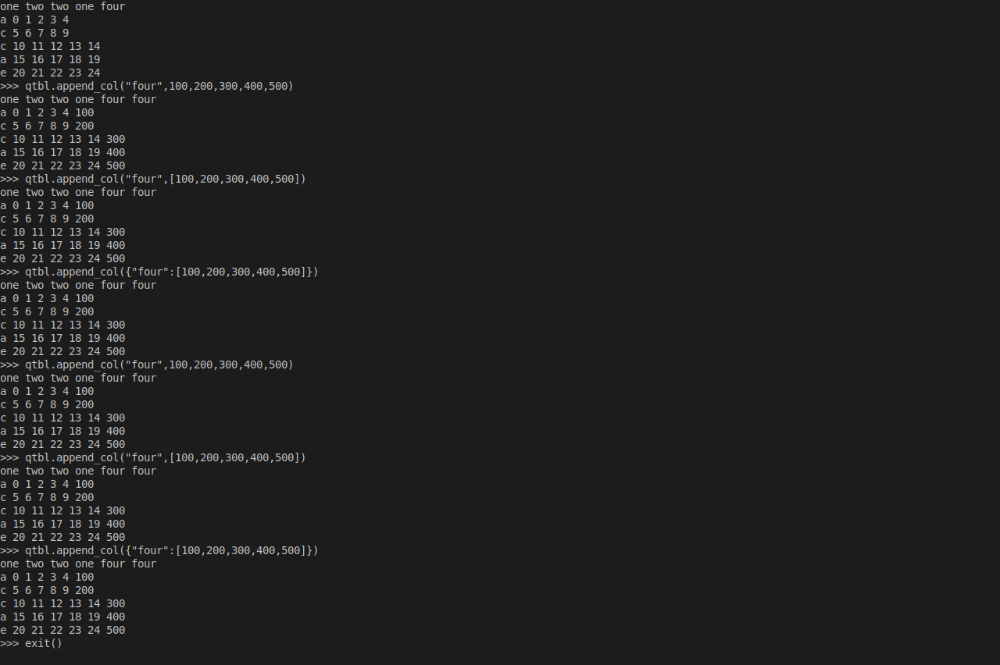

27. append_cols-1
#################

    ::
    
        from qtable.qtable import *
        
        qtbl = Qtable(allow_duplicates=False,mat= np.arange(25).reshape((5,5)),index=['a','b','c','d','e'],columns=['one', 'two', 'three','four','five'])
        qtbl
        
        qtbl.append_cols("x",100,200,300,400,500,"y",1000,2000,3000,4000,5000)
        qtbl.append_cols("x",[100,200,300,400,500],"y",[1000,2000,3000,4000,5000])
        qtbl.append_cols({"x":[100,200,300,400,500],"y":[1000,2000,3000,4000,5000]})
        qtbl.append_cols("three",100,200,300,400,500,"three",1000,2000,3000,4000,5000)
        
        qtbl.append_cols("x",100,200,300,400,500,"y",1000,2000,3000,4000,5000)
        qtbl.append_cols("x",[100,200,300,400,500],"y",[1000,2000,3000,4000,5000])
        qtbl.append_cols({"x":[100,200,300,400,500],"y":[1000,2000,3000,4000,5000]})
        qtbl.append_cols("three",100,200,300,400,500,"three",1000,2000,3000,4000,5000)

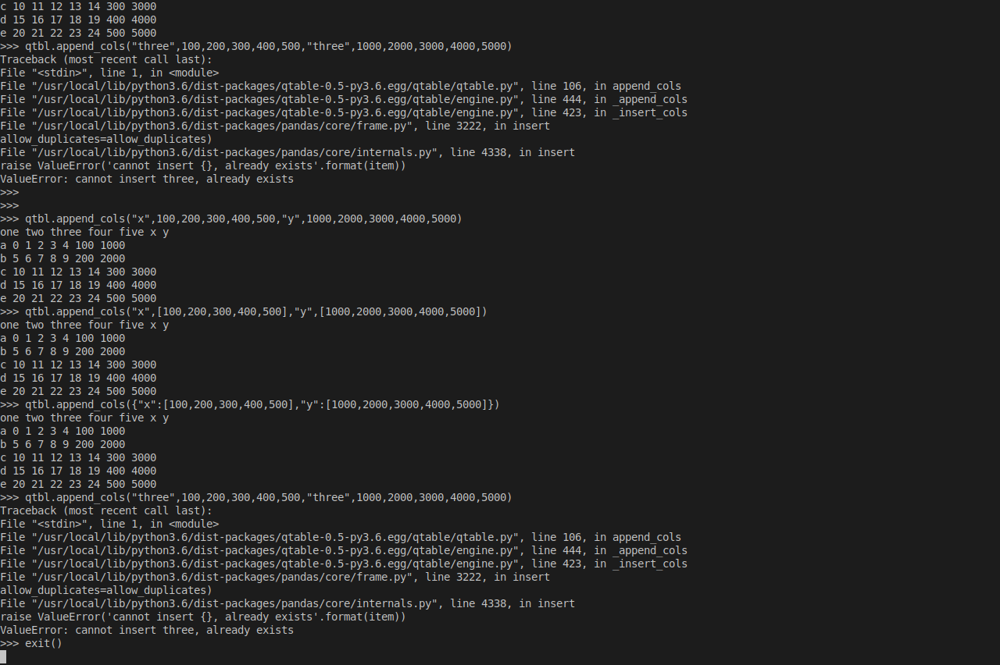

28. append_cols-2
#################

    ::
    
        from qtable.qtable import *
        
        qtbl = Qtable(mat= np.arange(25).reshape((5,5)),index=['a','c','c','a','e'],columns=['one', 'two', 'two','one','four'])
        qtbl
        qtbl.append_cols({"x":[100,200,300,400,500],"y":[1000,2000,3000,4000,5000]})
        qtbl.append_cols("three",100,200,300,400,500,"three",1000,2000,3000,4000,5000)
        qtbl.append_cols("three",[100,200,300,400,500],"three",[1000,2000,3000,4000,5000])
        
        qtbl.append_cols({"x":[100,200,300,400,500],"y":[1000,2000,3000,4000,5000]})
        qtbl.append_cols("three",100,200,300,400,500,"three",1000,2000,3000,4000,5000)
        qtbl.append_cols("three",[100,200,300,400,500],"three",[1000,2000,3000,4000,5000])

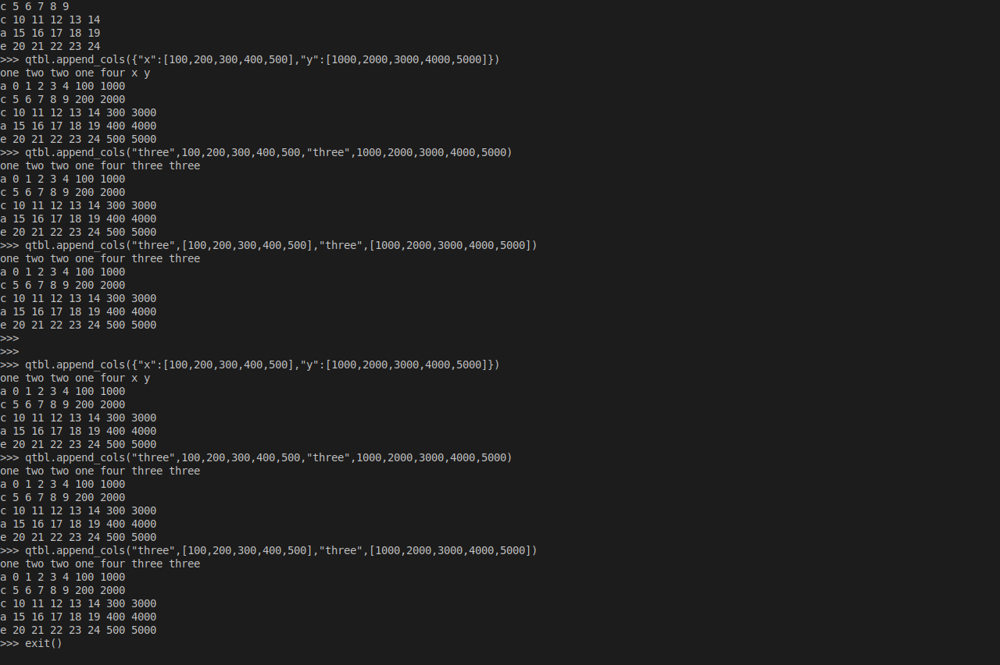

29. append_row-1
################

    ::
    
        from qtable.qtable import *
        
        qtbl = Qtable(allow_duplicates=False,mat= np.arange(25).reshape((5,5)),index=['a','b','c','d','e'],columns=['one', 'two', 'three','four','five'])
        qtbl
        qtbl.append_row("x",100,200,300,400,500)
        qtbl.append_row("x",[100,200,300,400,500])
        qtbl.append_row({"x":[100,200,300,400,500]})
        qtbl.append_row("x",100,200,300,400,500)
        qtbl.append_row("x",[100,200,300,400,500])
        qtbl.append_row({"x":[100,200,300,400,500]})

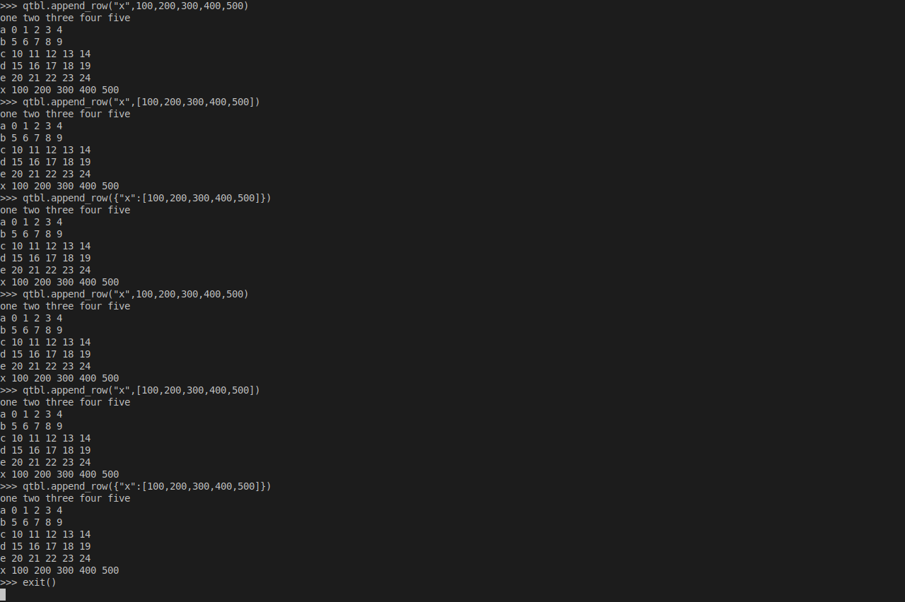

30. append_row-2
################

    ::
    
        from qtable.qtable import *
        
        qtbl = Qtable(mat= np.arange(25).reshape((5,5)),index=['a','c','c','a','e'],columns=['one', 'two', 'two','one','four'])
        qtbl
        qtbl.append_row("c",100,200,300,400,500)
        qtbl.append_row("c",[100,200,300,400,500])
        qtbl.append_row({"c":[100,200,300,400,500]})
        qtbl.append_row("c",100,200,300,400,500)
        qtbl.append_row("c",[100,200,300,400,500])
        qtbl.append_row({"c":[100,200,300,400,500]})
        
        
        

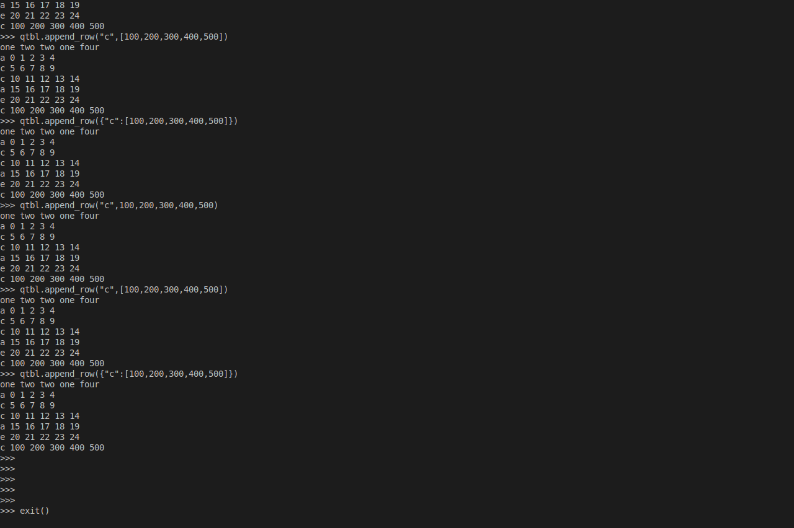

31. append_rows-1
#################

    ::
    
        from qtable.qtable import *
        
        qtbl = Qtable(allow_duplicates=False,mat= np.arange(25).reshape((5,5)),index=['a','b','c','d','e'],columns=['one', 'two', 'three','four','five'])
        qtbl
        qtbl.append_rows("x",100,200,300,400,500,"y",1000,2000,3000,4000,5000)
        qtbl.append_rows("x",[100,200,300,400,500],"y",[1000,2000,3000,4000,5000])
        qtbl.append_rows({"x":[100,200,300,400,500],"y":[1000,2000,3000,4000,5000]})
        qtbl.append_rows("x",100,200,300,400,500,"y",1000,2000,3000,4000,5000)
        qtbl.append_rows("x",[100,200,300,400,500],"y",[1000,2000,3000,4000,5000])
        qtbl.append_rows({"x":[100,200,300,400,500],"y":[1000,2000,3000,4000,5000]})
        
        
        

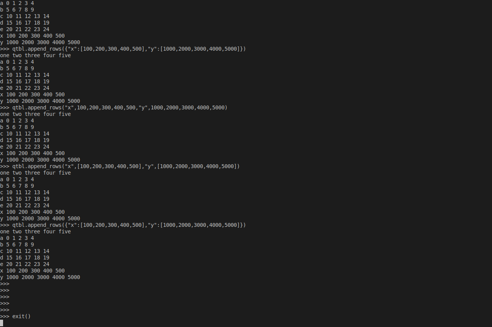

32. append_rows-2
#################

    ::
    
        from qtable.qtable import *
        
        qtbl = Qtable(mat= np.arange(25).reshape((5,5)),index=['a','c','c','a','e'],columns=['one', 'two', 'two','one','four'])
        qtbl
        
        qtbl.append_rows("x",100,200,300,400,500,"y",1000,2000,3000,4000,5000)
        qtbl.append_rows("x",[100,200,300,400,500],"y",[1000,2000,3000,4000,5000])
        qtbl.append_rows({"x":[100,200,300,400,500],"y":[1000,2000,3000,4000,5000]})
        qtbl.append_rows("x",100,200,300,400,500,"y",1000,2000,3000,4000,5000)
        qtbl.append_rows("x",[100,200,300,400,500],"y",[1000,2000,3000,4000,5000])
        qtbl.append_rows({"x":[100,200,300,400,500],"y":[1000,2000,3000,4000,5000]})
        
        
        

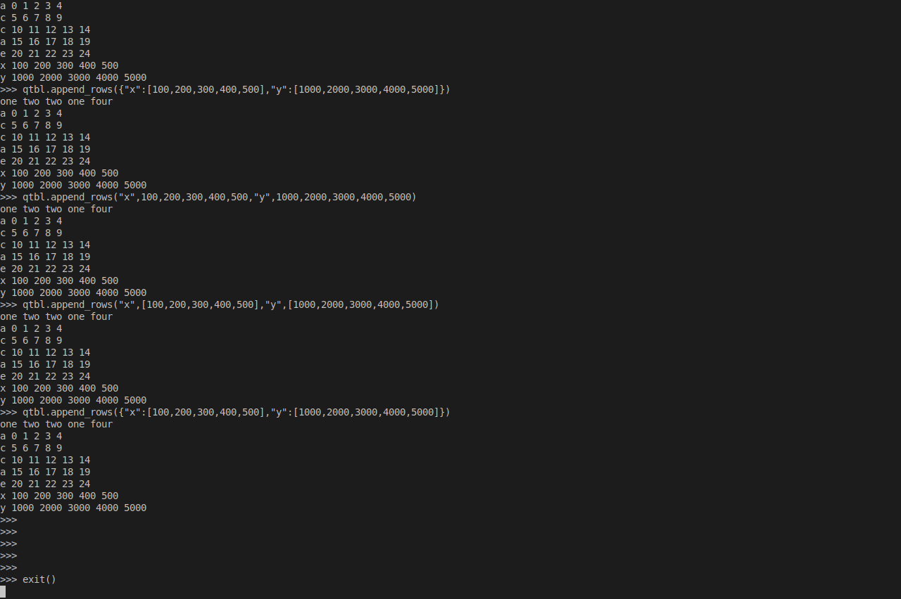

33. prepend_col-1
#################

    ::
    
        from qtable.qtable import *
        
        qtbl = Qtable(allow_duplicates=False,mat= np.arange(25).reshape((5,5)),index=['a','b','c','d','e'],columns=['one', 'two', 'three','four','five'])
        qtbl
        
        qtbl.prepend_col("x",100,200,300,400,500)
        qtbl.prepend_col("x",[100,200,300,400,500])
        qtbl.prepend_col({"x":[100,200,300,400,500]})
        
        qtbl.prepend_col("x",100,200,300,400,500)
        qtbl.prepend_col("x",[100,200,300,400,500])
        qtbl.prepend_col({"x":[100,200,300,400,500]})

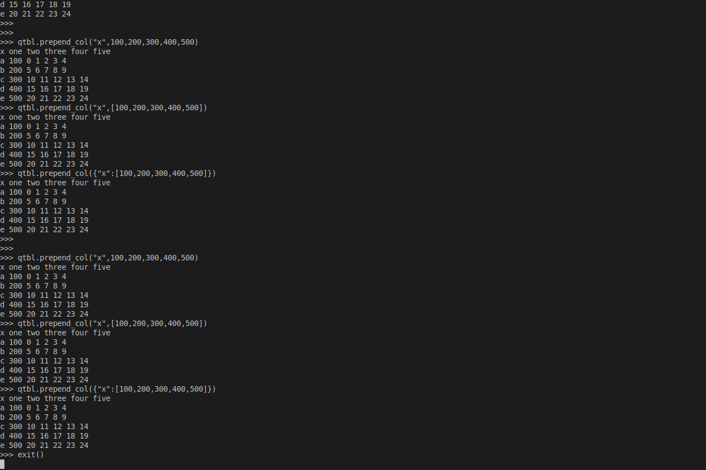

34. prepend_col-2
#################

    ::
    
        from qtable.qtable import *
        
        qtbl = Qtable(mat= np.arange(25).reshape((5,5)),index=['a','c','c','a','e'],columns=['one', 'two', 'two','one','four'])
        qtbl
        qtbl.prepend_col("four",100,200,300,400,500)
        qtbl.prepend_col("four",[100,200,300,400,500])
        qtbl.prepend_col({"four":[100,200,300,400,500]})
        qtbl.prepend_col("four",100,200,300,400,500)
        qtbl.prepend_col("four",[100,200,300,400,500])
        qtbl.prepend_col({"four":[100,200,300,400,500]})
        
        
        

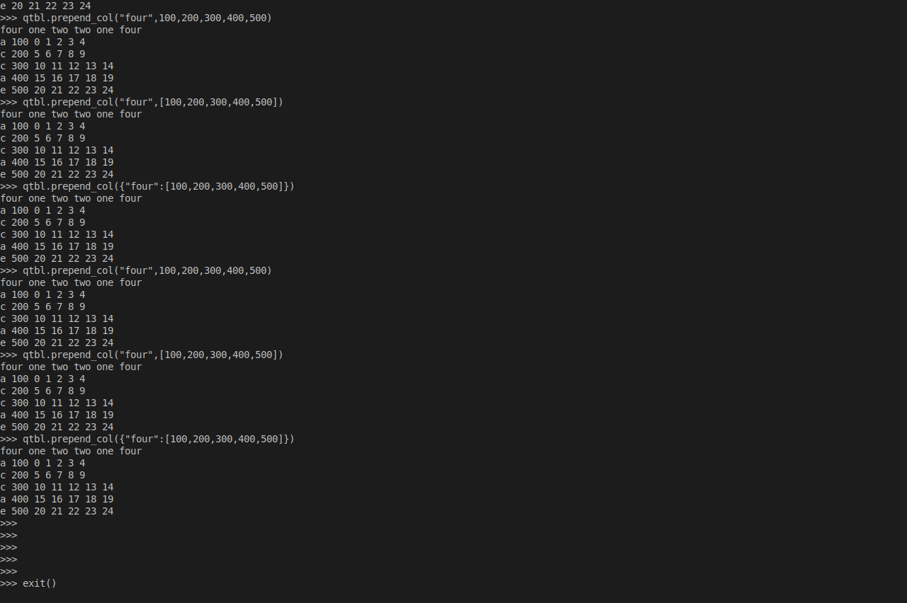

35. prepend_cols-1
##################

    ::
    
        from qtable.qtable import *
        
        qtbl = Qtable(allow_duplicates=False,mat= np.arange(25).reshape((5,5)),index=['a','b','c','d','e'],columns=['one', 'two', 'three','four','five'])
        qtbl
        
        qtbl.prepend_cols("x",100,200,300,400,500,"y",1000,2000,3000,4000,5000)
        qtbl.prepend_cols("x",[100,200,300,400,500],"y",[1000,2000,3000,4000,5000])
        qtbl.prepend_cols({"x":[100,200,300,400,500],"y":[1000,2000,3000,4000,5000]})
        qtbl.prepend_cols("three",100,200,300,400,500,"three",1000,2000,3000,4000,5000)
        
        qtbl.prepend_cols("x",100,200,300,400,500,"y",1000,2000,3000,4000,5000)
        qtbl.prepend_cols("x",[100,200,300,400,500],"y",[1000,2000,3000,4000,5000])
        qtbl.prepend_cols({"x":[100,200,300,400,500],"y":[1000,2000,3000,4000,5000]})
        qtbl.prepend_cols("three",100,200,300,400,500,"three",1000,2000,3000,4000,5000)

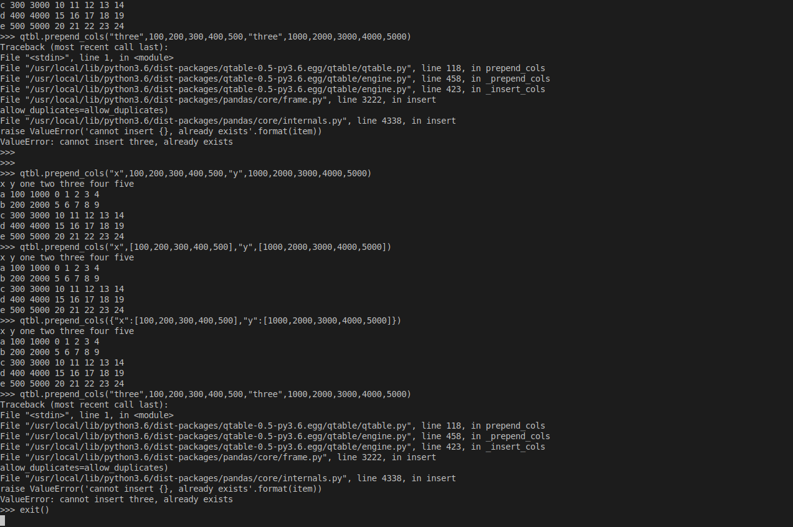

36. prepend_cols-2
##################

    ::
    
        from qtable.qtable import *
        
        qtbl = Qtable(mat= np.arange(25).reshape((5,5)),index=['a','c','c','a','e'],columns=['one', 'two', 'two','one','four'])
        qtbl
        qtbl.prepend_cols({"x":[100,200,300,400,500],"y":[1000,2000,3000,4000,5000]})
        qtbl.prepend_cols("three",100,200,300,400,500,"three",1000,2000,3000,4000,5000)
        qtbl.prepend_cols("three",[100,200,300,400,500],"three",[1000,2000,3000,4000,5000])
        
        qtbl.prepend_cols({"x":[100,200,300,400,500],"y":[1000,2000,3000,4000,5000]})
        qtbl.prepend_cols("three",100,200,300,400,500,"three",1000,2000,3000,4000,5000)
        qtbl.prepend_cols("three",[100,200,300,400,500],"three",[1000,2000,3000,4000,5000])

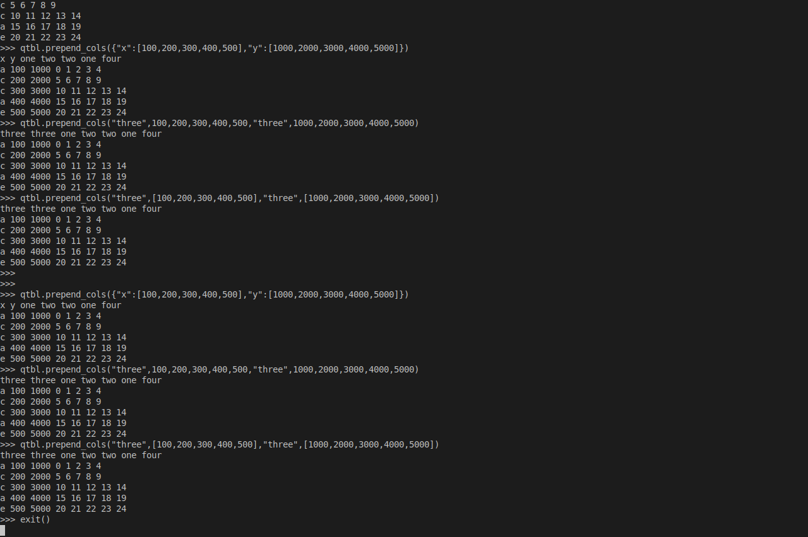

37. prepend_row-1
#################

    ::
    
        from qtable.qtable import *
        
        qtbl = Qtable(allow_duplicates=False,mat= np.arange(25).reshape((5,5)),index=['a','b','c','d','e'],columns=['one', 'two', 'three','four','five'])
        qtbl
        qtbl.prepend_row("x",100,200,300,400,500)
        qtbl.prepend_row("x",[100,200,300,400,500])
        qtbl.prepend_row({"x":[100,200,300,400,500]})
        qtbl.prepend_row("x",100,200,300,400,500)
        qtbl.prepend_row("x",[100,200,300,400,500])
        qtbl.prepend_row({"x":[100,200,300,400,500]})

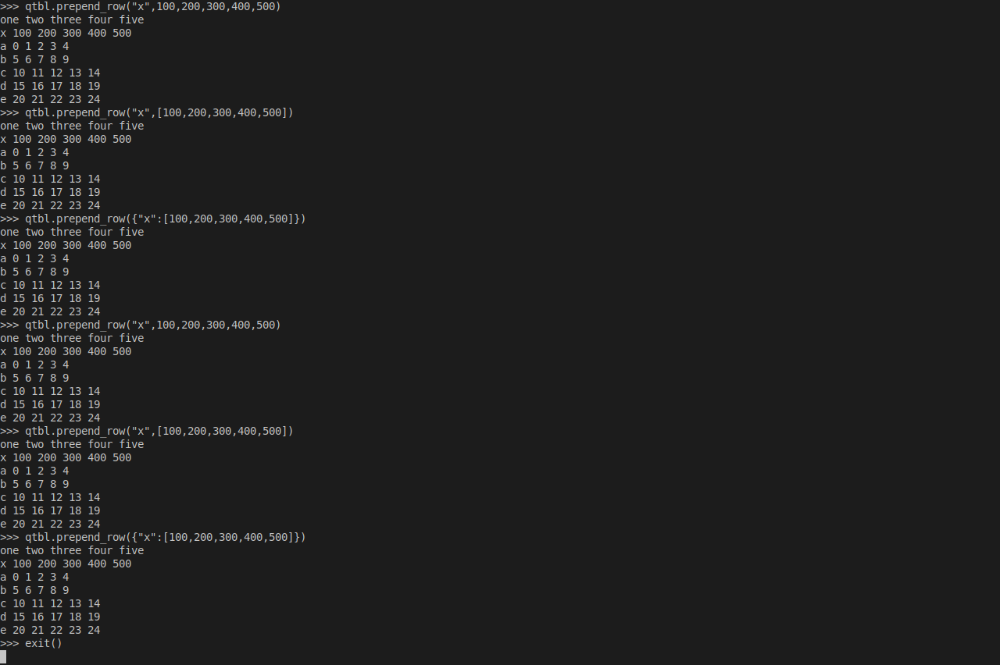

38. prepend_row-2
#################

    ::
    
        from qtable.qtable import *
        
        qtbl = Qtable(mat= np.arange(25).reshape((5,5)),index=['a','c','c','a','e'],columns=['one', 'two', 'two','one','four'])
        qtbl
        qtbl.prepend_row("c",100,200,300,400,500)
        qtbl.prepend_row("c",[100,200,300,400,500])
        qtbl.prepend_row({"c":[100,200,300,400,500]})
        qtbl.prepend_row("c",100,200,300,400,500)
        qtbl.prepend_row("c",[100,200,300,400,500])
        qtbl.prepend_row({"c":[100,200,300,400,500]})
        
        
        
        

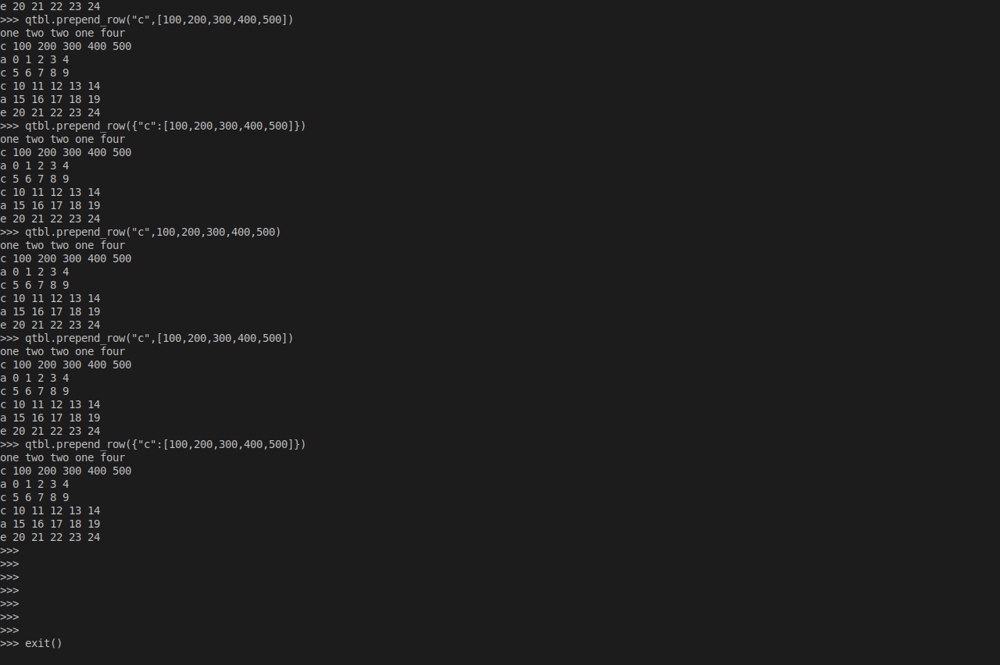

39. prepend_rows-1
##################

    ::
    
        from qtable.qtable import *
        
        qtbl = Qtable(allow_duplicates=False,mat= np.arange(25).reshape((5,5)),index=['a','b','c','d','e'],columns=['one', 'two', 'three','four','five'])
        qtbl
        qtbl.prepend_rows("x",100,200,300,400,500,"y",1000,2000,3000,4000,5000)
        qtbl.prepend_rows("x",[100,200,300,400,500],"y",[1000,2000,3000,4000,5000])
        qtbl.prepend_rows({"x":[100,200,300,400,500],"y":[1000,2000,3000,4000,5000]})
        qtbl.prepend_rows("x",100,200,300,400,500,"y",1000,2000,3000,4000,5000)
        qtbl.prepend_rows("x",[100,200,300,400,500],"y",[1000,2000,3000,4000,5000])
        qtbl.prepend_rows({"x":[100,200,300,400,500],"y":[1000,2000,3000,4000,5000]})
        
        
        

40. prepend_rows-2
##################

    ::
    
        from qtable.qtable import *
        
        qtbl = Qtable(mat= np.arange(25).reshape((5,5)),index=['a','c','c','a','e'],columns=['one', 'two', 'two','one','four'])
        qtbl
        
        qtbl.prepend_rows("x",100,200,300,400,500,"y",1000,2000,3000,4000,5000)
        qtbl.prepend_rows("x",[100,200,300,400,500],"y",[1000,2000,3000,4000,5000])
        qtbl.prepend_rows({"x":[100,200,300,400,500],"y":[1000,2000,3000,4000,5000]})
        qtbl.prepend_rows("x",100,200,300,400,500,"y",1000,2000,3000,4000,5000)
        qtbl.prepend_rows("x",[100,200,300,400,500],"y",[1000,2000,3000,4000,5000])
        qtbl.prepend_rows({"x":[100,200,300,400,500],"y":[1000,2000,3000,4000,5000]})
        
        
        

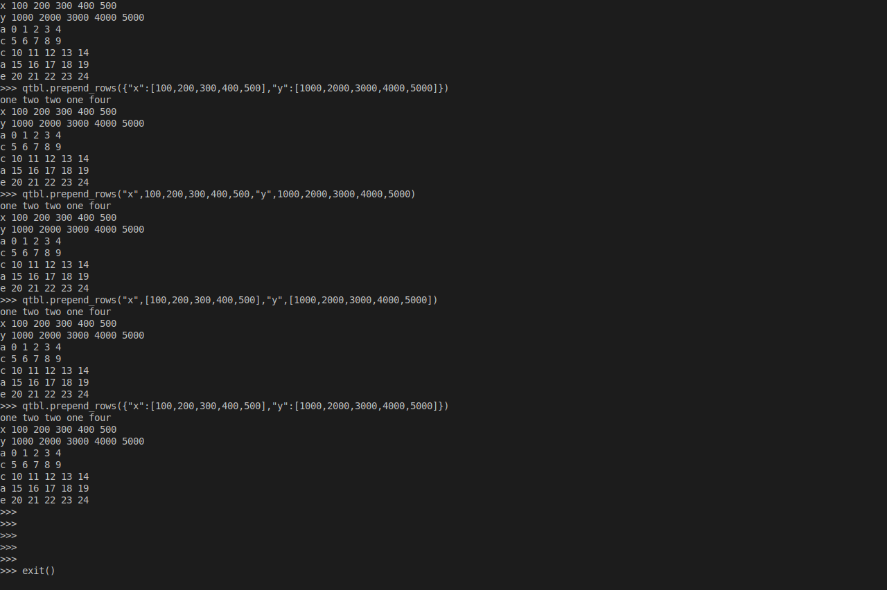

41. transpose
#############

    ::
    
        from qtable.qtable import *
        
        qtbl = Qtable(allow_duplicates=False,mat= np.arange(25).reshape((5,5)),index=['a','b','c','d','e'],columns=['one', 'two', 'three','four','five'])
        qtbl
        qtbl.transpose()
        
        
        qtbl = Qtable(mat= np.arange(25).reshape((5,5)),index=['a','c','c','a','e'],columns=['one', 'two', 'two','one','four'])
        qtbl
        qtbl.transpose()

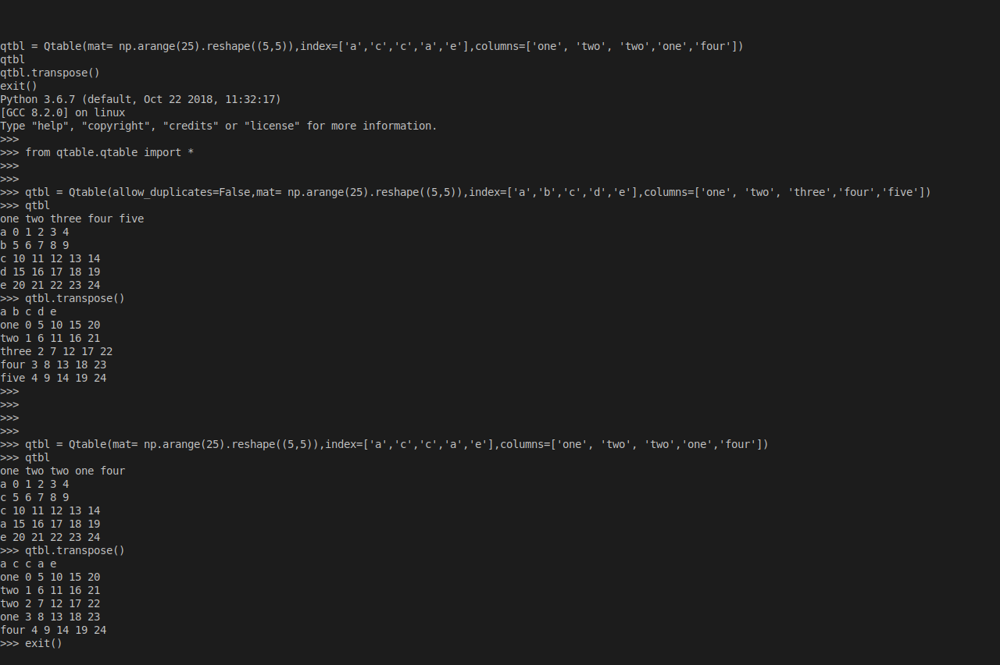

42. rename_cols
###############

    ::
    
        from qtable.qtable import *
        
        qtbl = Qtable(allow_duplicates=False,mat= np.arange(25).reshape((5,5)),index=['a','b','c','d','e'],columns=['one', 'two', 'three','four','five'])
        qtbl
        qtbl.rename_cols("C0","C1","C2","C3","C4")
        qtbl.rename_cols(["C0","C1","C2","C3","C4"])
        
        
        qtbl = Qtable(mat= np.arange(25).reshape((5,5)),index=['a','c','c','a','e'],columns=['one', 'two', 'two','one','four'])
        qtbl
        qtbl.rename_rows("R0","R1","R2","R3","R4")
        qtbl.rename_rows(["R0","R1","R2","R3","R4"])

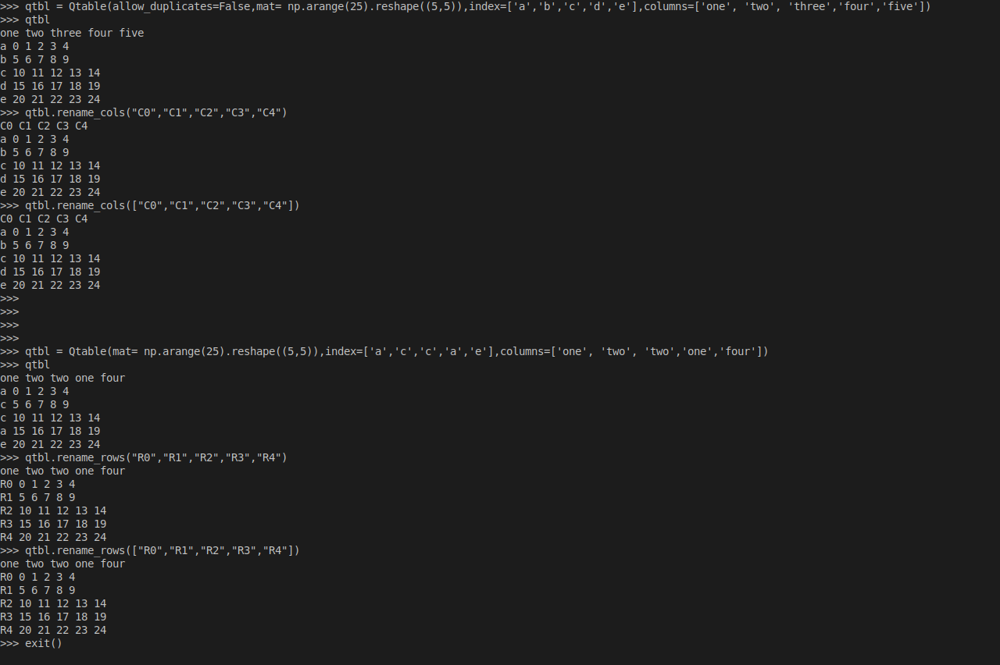

43. repl_col-1
##############

    ::
    
        from qtable.qtable import *
        
        qtbl = Qtable(allow_duplicates=False,mat= np.arange(25).reshape((5,5)),index=['a','b','c','d','e'],columns=['one', 'two', 'three','four','five'])
        qtbl
        qtbl.repl_col("three","x",100,200,300,400,500)
        qtbl.repl_col("three","x",[100,200,300,400,500])
        qtbl.repl_col("three",{"x":[100,200,300,400,500]})
        qtbl.repl_col(2,"x",100,200,300,400,500)
        qtbl.repl_col(2,"x",[100,200,300,400,500])
        qtbl.repl_col(2,{"x":[100,200,300,400,500]})

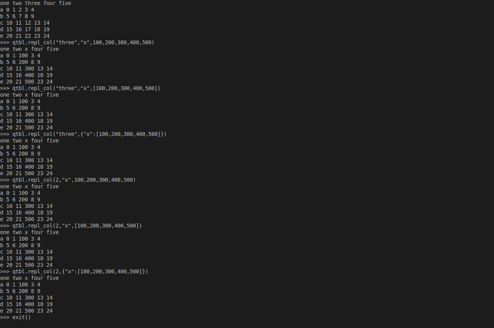

44. repl_col-2
##############

    ::
    
        from qtable.qtable import *
        
        qtbl = Qtable(mat= np.arange(25).reshape((5,5)),index=['a','c','c','a','e'],columns=['one', 'two', 'two','one','four'])
        qtbl
        
        qtbl.repl_col("two","x",100,200,300,400,500)
        qtbl.repl_col("two","x",[100,200,300,400,500])
        qtbl.repl_col("two",{"x":[100,200,300,400,500]})
        qtbl.repl_col(2,"x",100,200,300,400,500)
        qtbl.repl_col(2,"x",[100,200,300,400,500])
        qtbl.repl_col(2,{"x":[100,200,300,400,500]})
        qtbl.repl_col("two","x",[100,200,300,400,500],which=0)
        qtbl.repl_col("two","x",[100,200,300,400,500],which=1)
        
        
        

.. image:: ./images/repl_col-2.svg

45. repl_cols
#############

    ::
    
        from qtable.qtable import *
        
        qtbl = Qtable(allow_duplicates=False,mat= np.arange(25).reshape((5,5)),index=['a','b','c','d','e'],columns=['one', 'two', 'three','four','five'])
        qtbl
        qtbl.repl_cols(["one","two"],"x",100,200,300,400,500,"y",1000,2000,3000,4000,5000)
        
        qtbl = Qtable(mat= np.arange(25).reshape((5,5)),index=['a','c','c','a','e'],columns=['one', 'two', 'two','one','four'])
        qtbl
        qtbl.repl_cols(["one","two"],"x",100,200,300,400,500,"y",1000,2000,3000,4000,5000)
        qtbl.repl_cols(["one","two"],"x",100,200,300,400,500,"y",1000,2000,3000,4000,5000,whiches=[0,0])
        qtbl.repl_cols(["one","two"],"x",100,200,300,400,500,"y",1000,2000,3000,4000,5000,whiches=[0,1])
        qtbl.repl_cols(["one","two"],"x",100,200,300,400,500,"y",1000,2000,3000,4000,5000,whiches=[1,0])
        qtbl.repl_cols(["one","two"],"x",100,200,300,400,500,"y",1000,2000,3000,4000,5000,whiches=[1,1])
        
        
        

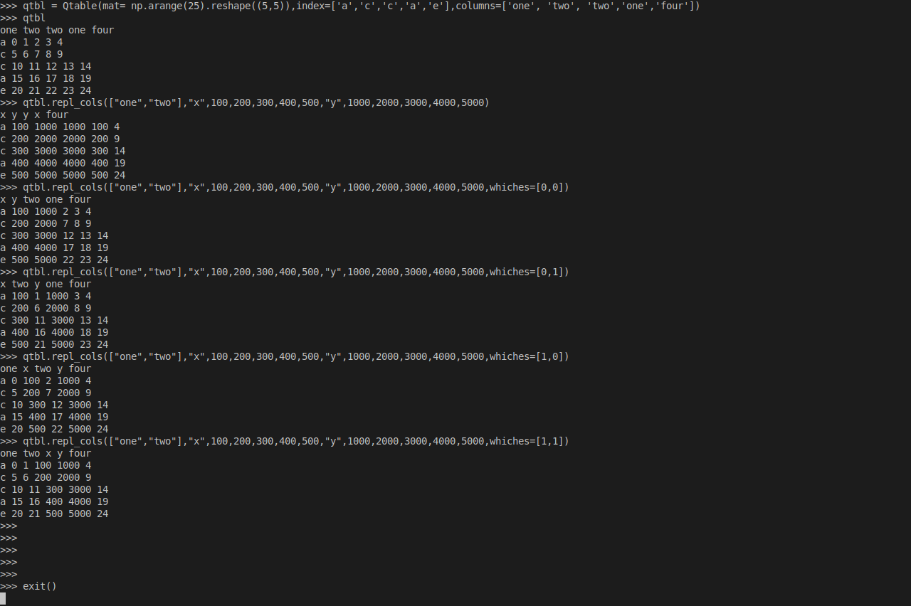

46. repl_row-1
##############

    ::
    
        from qtable.qtable import *
        
        qtbl = Qtable(allow_duplicates=False,mat= np.arange(25).reshape((5,5)),index=['a','b','c','d','e'],columns=['one', 'two', 'three','four','five'])
        qtbl
        qtbl.repl_row("b","bb",100,200,300,400,500)
        qtbl.repl_row("b","bb",[100,200,300,400,500])
        qtbl.repl_row("b",{"bb":[100,200,300,400,500]})
        qtbl.repl_row(1,"bb",100,200,300,400,500)
        qtbl.repl_row(1,"bb",[100,200,300,400,500])
        qtbl.repl_row(1,{"bb":[100,200,300,400,500]})
        
        
        

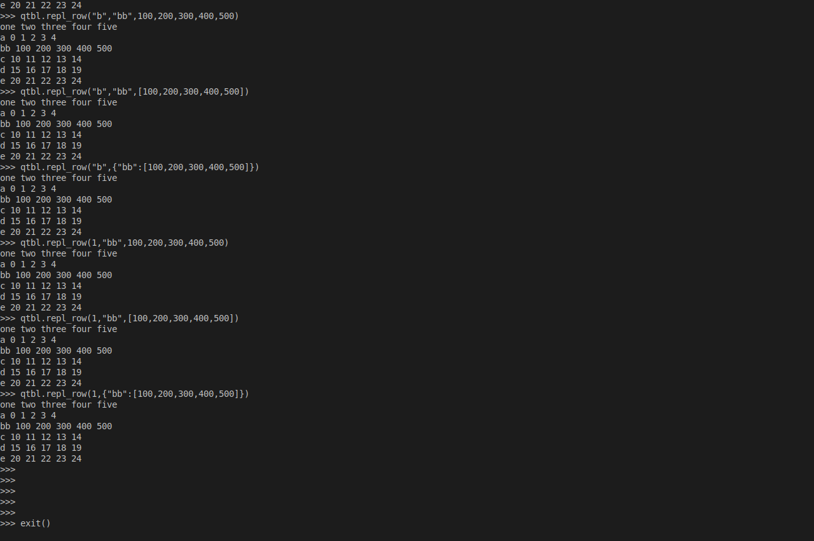

47. repl_row-2
##############

    ::
    
        from qtable.qtable import *
        
        qtbl = Qtable(mat= np.arange(25).reshape((5,5)),index=['a','c','c','a','e'],columns=['one', 'two', 'two','one','four'])
        qtbl
        
        qtbl.repl_row("a","aa",100,200,300,400,500)
        qtbl.repl_row("a","aa",[100,200,300,400,500])
        qtbl.repl_row("a",{"aa":[100,200,300,400,500]})
        
        qtbl.repl_row("a","aa",[100,200,300,400,500],which=1)
        
        
        

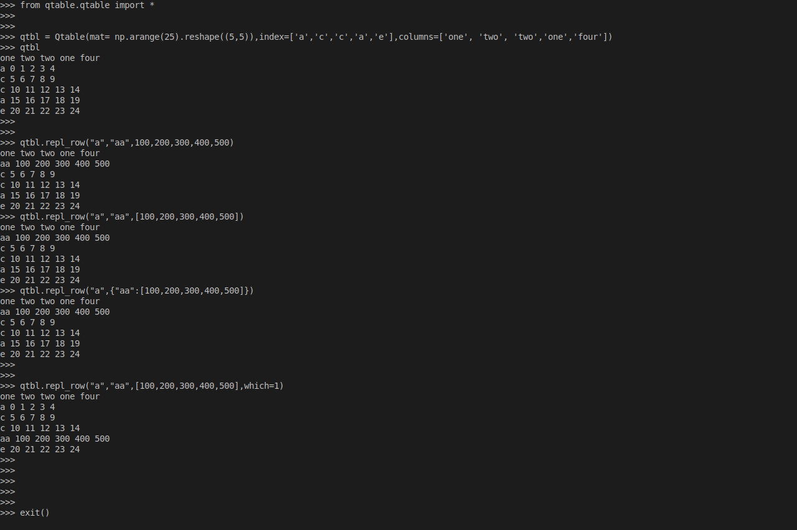

48. repl_rows
#############

    ::
    
        from qtable.qtable import *
        
        qtbl = Qtable(allow_duplicates=False,mat= np.arange(25).reshape((5,5)),index=['a','b','c','d','e'],columns=['one', 'two', 'three','four','five'])
        qtbl
        qtbl.repl_rows(["b","c"],"x",100,200,300,400,500,"y",1000,2000,3000,4000,5000)
        
        
        qtbl = Qtable(mat= np.arange(25).reshape((5,5)),index=['a','c','c','a','e'],columns=['one', 'two', 'two','one','four'])
        qtbl
        qtbl.repl_rows(["a","c"],"x",100,200,300,400,500,"y",1000,2000,3000,4000,5000,whiches=[0,0])
        qtbl.repl_rows(["a","c"],"x",100,200,300,400,500,"y",1000,2000,3000,4000,5000,whiches=[0,1])
        qtbl.repl_rows(["a","c"],"x",100,200,300,400,500,"y",1000,2000,3000,4000,5000,whiches=[1,0])
        qtbl.repl_rows(["a","c"],"x",100,200,300,400,500,"y",1000,2000,3000,4000,5000,whiches=[1,1])
        
        
        

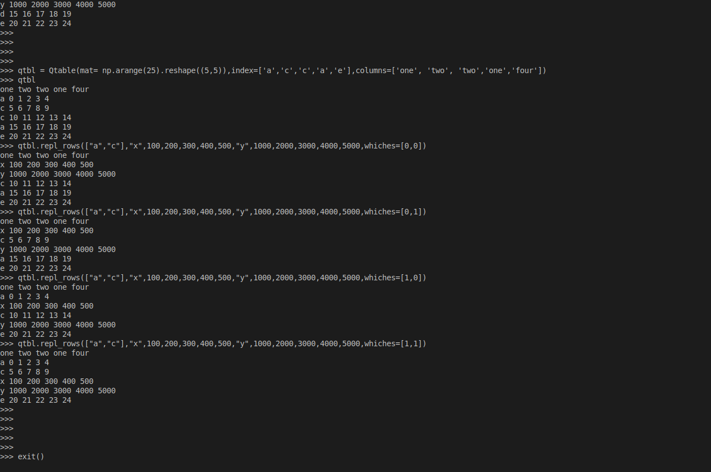

49. flipud
##########

    ::
    
        from qtable.qtable import *
        
        qtbl = Qtable(allow_duplicates=False,mat= np.arange(25).reshape((5,5)),index=['a','b','c','d','e'],columns=['one', 'two', 'three','four','five'])
        qtbl
        qtbl.flipud()
        
        qtbl = Qtable(mat= np.arange(25).reshape((5,5)),index=['a','c','c','a','e'],columns=['one', 'two', 'two','one','four'])
        qtbl
        qtbl.flipud()

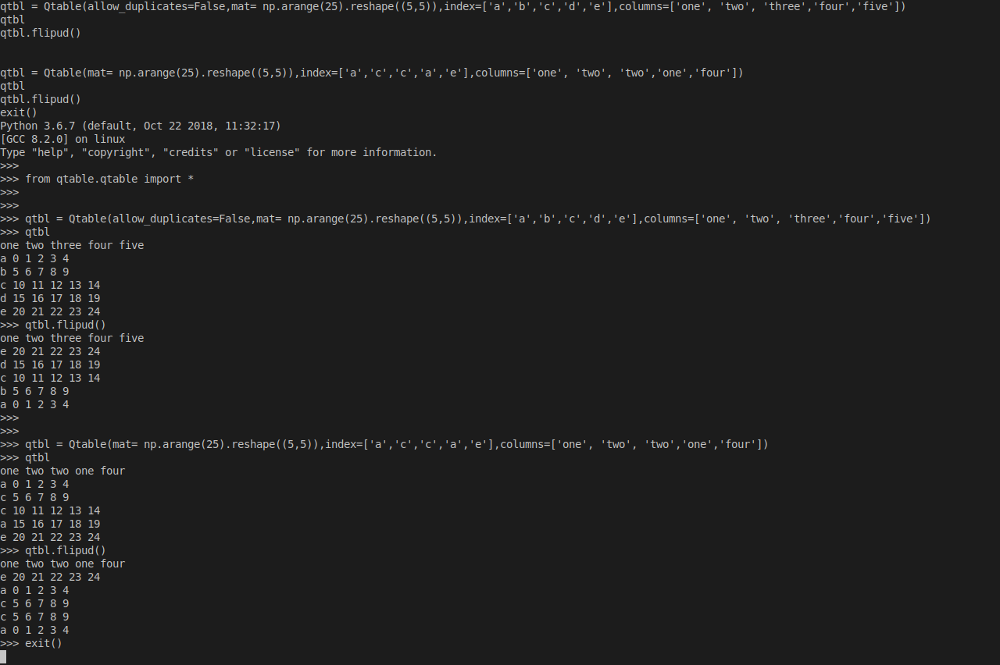

50. fliplr
##########

    ::
    
        from qtable.qtable import *
        
        qtbl = Qtable(allow_duplicates=False,mat= np.arange(25).reshape((5,5)),index=['a','b','c','d','e'],columns=['one', 'two', 'three','four','five'])
        qtbl
        qtbl.fliplr()
        
        qtbl = Qtable(mat= np.arange(25).reshape((5,5)),index=['a','c','c','a','e'],columns=['one', 'two', 'two','one','four'])
        qtbl
        qtbl.fliplr()
        
        
        

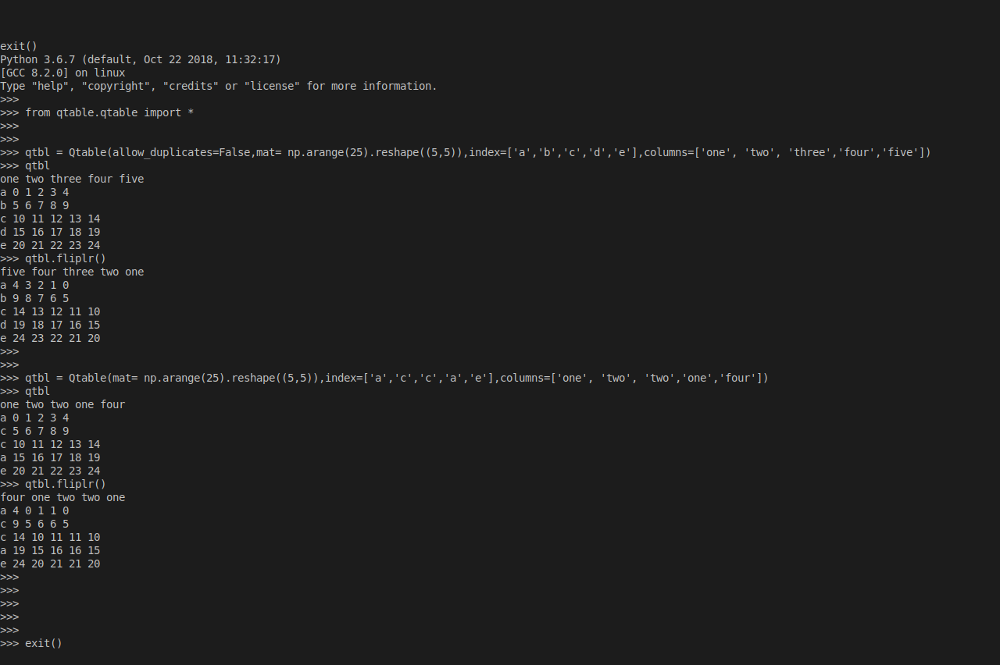

